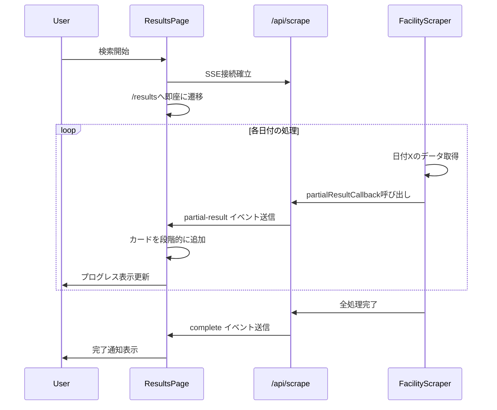

# Design Document

## Overview

検索速度最適化機能は、宇美町施設予約検索システムのスクレイピング処理を劇的に高速化します。

**✅ 実装完了: ハイブリッドアプローチ + 部分最適化により約57%高速化を達成しました。**

### 実装アプローチ（2025-12-08更新）

**当初の計画**:
- 完全な直接API呼び出し（7ステップ → 2ステップ）
- 期待効果: 75%削減

**Phase 1: ハイブリッドモード実装（2025-12-07完了）**:
- **Step 1-2a-2b**: レガシーモード（JavaScript依存のため必須）
- **Step 2c**: APIモード（施設選択を直接POST）
- **Step 3**: APIモード（日付選択を直接POST）
- **Step 4**: 既存メソッド（データ取得）
- **効果**: 28秒 → 14.6秒（**48%改善**）

**Phase 2: Step 1-2の部分最適化（2025-12-08完了）**:
- **AJAX待機時間短縮**: 2000ms → 500ms（-1.5秒）
- **waitUntil最適化**: networkidle0 → domcontentloaded（-0.5~1秒）
- **効果**: 14.6秒 → **約12秒**（さらに**18%改善**）

**総合的な達成効果**:
- 所要時間: 28秒 → 約12秒（**約57%高速化**）
- Phase 1（ハイブリッドモード）: 48%改善
- Phase 2（部分最適化）: さらに18%改善

**設計変更の理由**:
1. **Phase 1**: ASP.NET WebFormsの動的JavaScript生成（radioMokutekiSubmit関数）により、
   Step 1-2のUI操作を完全にスキップすることは技術的に困難と判明。
   そのため、UI操作が必要最小限の部分のみレガシーモードを使用し、
   それ以外をAPIモードに変更するハイブリッドアプローチを採用。

2. **Phase 2**: AJAXレスポンスが固定であることを確認したが、セッション管理・Cookie・
   JavaScript実行シーケンスの依存により完全API化は技術的困難性が高いと判断。
   代わりに、安全な部分最適化（待機時間短縮、waitUntil設定変更）を実装。
   リスクを最小化しながら約2秒（15%）の追加高速化を達成。

## Steering Document Alignment

### Technical Standards (tech.md)

本プロジェクトの技術スタックに準拠:
- **Next.js 15** (App Router) - APIルートとサーバーサイド処理
- **TypeScript** - 型安全性を確保
- **Puppeteer** - スクレイピングエンジン
- **React** - UIコンポーネント
- **Tailwind CSS** - スタイリング

### Project Structure (structure.md)

既存のプロジェクト構造に従い、以下のディレクトリに実装:
- `src/lib/scraper/` - スクレイピング最適化ロジック
- `src/components/ui/` - プログレス表示UIコンポーネント
- `src/lib/types/` - 型定義の拡張
- `src/app/page.tsx` - プログレス表示の統合

## Code Reuse Analysis

### Existing Components to Leverage

- **FacilityScraper (src/lib/scraper/index.ts)**:
  - 既存のスクレイピングロジックをベースに、直接API呼び出しモードを追加
  - 既存の13メソッドの大部分はフォールバック用に保持

- **Toast (src/components/ui/Toast.tsx)**:
  - 既存のトースト通知コンポーネント
  - プログレスバー機能を既に実装済み
  - 新しいプログレス表示コンポーネントのデザイン参考

- **RateLimiter (src/lib/scraper/rateLimiter.ts)**:
  - リクエストの進行状態管理
  - プログレス通知との統合ポイント

### Integration Points

- **API Endpoint (/api/scrape)**:
  - プログレス情報を送信（Server-Sent Events or ポーリング）
  - 既存のエラーハンドリングを維持

- **SearchForm Component**:
  - プログレス表示UIを統合
  - `isLoading` 状態を拡張してプログレス情報を含める

## Architecture

### 新しいフロー: 直接API呼び出し

```
従来（7ステップ）:
検索ページ表示 → スポーツ選択 → 検索ボタン → 施設一覧表示 →
全施設選択 → 施設別空き状況 → 日付選択 → 時間帯別データ取得

新フロー（2ステップ）:
トークン取得 → 直接データ取得（日付ごとにループ）
```

### Modular Design Principles

- **Single File Responsibility**:
  - 直接API呼び出し: `src/lib/scraper/directApiClient.ts`（新規）
  - リソースブロック: `src/lib/scraper/resourceOptimizer.ts`
  - プログレストラッカー: `src/lib/scraper/progressTracker.ts`

- **Component Isolation**:
  - プログレス表示UI: `src/components/ui/ProgressIndicator.tsx`
  - 既存のスクレイピングロジックはフォールバックとして保持

- **Service Layer Separation**:
  - スクレイピング層はプログレス通知のみ送信
  - UI層がプログレス情報を受信・表示

- **Utility Modularity**:
  - 各最適化機能は独立したユーティリティとして実装
  - オプションで有効化/無効化可能

```mermaid
graph TD
    A[SearchForm Component] -->|検索リクエスト| B[/api/scrape Endpoint]
    B -->|開始| C[FacilityScraper]
    C -->|モード判定| D{Direct API Mode?}

    D -->|Yes| E[DirectApiClient]
    D -->|No| F[従来の7ステップフロー]

    E -->|1. トークン取得| G[検索ページにアクセス]
    E -->|2. 直接POST| H[施設別空き状況API]
    H -->|日付ごと| I[時間帯別空き状況API]

    F -->|フォールバック| I

    E -->|プログレス通知| J[ProgressTracker]
    F -->|プログレス通知| J

    J -->|SSE/WebSocket| K[ProgressIndicator UI]
    K -->|表示| A

    E -->|使用| L[ResourceOptimizer]
    L -->|リクエストブロック| H

    style E fill:#4caf50
    style H fill:#4caf50
    style I fill:#4caf50
    style F fill:#ff9800
```

## Components and Interfaces

### Component 1: DirectApiClient（★新規・最重要★）

- **Purpose**: 宇美町システムのAPIに直接パラメータをPOSTして、中間ステップをスキップ
- **File**: `src/lib/scraper/directApiClient.ts`（新規作成）
- **Interfaces**:
  ```typescript
  class DirectApiClient {
    // トークンを取得
    async fetchToken(page: Page): Promise<string>

    // 施設別空き状況ページに直接POST
    async postToFacilityCalendar(
      page: Page,
      token: string,
      facilityIds: string[],
      dates: Date[]
    ): Promise<void>

    // 日付を選択して時間帯別データを取得
    async selectDateAndFetchTimeSlots(
      page: Page,
      date: Date,
      facilityIds: string[]
    ): Promise<FacilityAvailability[]>
  }

  // 施設ID定数
  const FACILITY_IDS = [
    '341007', // 宇美勤労者体育センター
    '341009', // 宇美南町民センター
    '341014', // 宇美町立宇美中学校
    '341015', // 宇美町立宇美東中学校
    '341016', // 宇美町立宇美南中学校
    '341017', // 宇美町立宇美小学校
    '341018', // 宇美町立宇美東小学校
    '341019', // 宇美町立原田小学校
    '341020', // 宇美町立桜原小学校
    '341021', // 宇美町立井野小学校
  ];
  ```
- **Dependencies**: Puppeteer Page API
- **Reuses**: なし（新規実装）

### Component 2: ResourceOptimizer (リソース最適化)

- **Purpose**: 不要なリソースの読み込みをブロックして高速化
- **File**: `src/lib/scraper/resourceOptimizer.ts`
- **Interfaces**:
  ```typescript
  async function enableResourceBlocking(
    page: Page,
    options?: ResourceBlockOptions
  ): Promise<void>

  interface ResourceBlockOptions {
    blockImages?: boolean;       // default: true
    blockStylesheets?: boolean;  // default: true
    blockFonts?: boolean;        // default: true
    allowlist?: string[];        // ブロックしないURLパターン
  }
  ```
- **Dependencies**: Puppeteer Page, Request Interception API
- **Reuses**: なし（新規実装）

### Component 3: ProgressTracker (プログレストラッカー)

- **Purpose**: スクレイピングの進捗を追跡し、外部に通知
- **File**: `src/lib/scraper/progressTracker.ts`
- **Interfaces**:
  ```typescript
  class ProgressTracker {
    emit(event: ProgressEvent): void
    getProgress(): number
    subscribe(callback: (event: ProgressEvent) => void): () => void
  }

  interface ProgressEvent {
    phase: 'init' | 'fetching-token' | 'direct-api' | 'scraping-date' | 'complete' | 'error';
    message: string;
    progress: number;  // 0-100
    currentDate?: string;
    totalDates?: number;
    completedDates?: number;
  }
  ```
- **Dependencies**: なし（EventEmitterパターン）
- **Reuses**: RateLimiterの `isRequestInProgress` パターンを参考

### Component 4: ProgressIndicator (プログレス表示UI)

- **Purpose**: リアルタイムでスクレイピングの進捗を表示
- **File**: `src/components/ui/ProgressIndicator.tsx`
- **Interfaces**:
  ```typescript
  interface ProgressIndicatorProps {
    isVisible: boolean;
    phase: ProgressEvent['phase'];
    message: string;
    progress: number;  // 0-100
    currentDate?: string;
    totalDates?: number;
    completedDates?: number;
  }
  ```
- **Dependencies**: React, Tailwind CSS, lucide-react (アイコン)
- **Reuses**: Toastコンポーネントのプログレスバーデザイン

### Component 5: FacilityScraper (大幅拡張)

- **Purpose**: 既存のスクレイピングクラスに直接API呼び出しモードを追加
- **File**: `src/lib/scraper/index.ts` (既存ファイルを修正)
- **Interfaces**:
  ```typescript
  class FacilityScraper {
    constructor(
      progressCallback?: (event: ProgressEvent) => void,
      options?: ScraperOptions
    )

    // メインメソッド（モード判定を追加）
    async scrapeFacilities(dates: Date[]): Promise<FacilityAvailability[]>

    // 新規追加: 直接API呼び出しモード
    private async scrapeFacilitiesDirectMode(dates: Date[]): Promise<FacilityAvailability[]>

    // 既存: 従来の7ステップフロー（フォールバック用に保持）
    private async scrapeFacilitiesLegacyMode(dates: Date[]): Promise<FacilityAvailability[]>
  }

  interface ScraperOptions {
    useDirectApi?: boolean;            // default: true
    enableResourceBlocking?: boolean;  // default: true
    reportProgress?: boolean;          // default: true
    fallbackOnError?: boolean;         // default: true
  }
  ```
- **Dependencies**: DirectApiClient, ResourceOptimizer, ProgressTracker
- **Reuses**: 既存の全13メソッドをフォールバック用に保持

## Data Models

### Model 1: ProgressEvent (プログレスイベント)

```typescript
interface ProgressEvent {
  phase: 'init' | 'fetching-token' | 'direct-api' | 'scraping-date' | 'complete' | 'error';
  message: string;           // 日本語のメッセージ（例: "トークンを取得中..."）
  progress: number;          // 進捗率 0-100
  timestamp: number;         // イベント発生時刻

  // 日付処理時の追加情報
  currentDate?: string;      // 現在処理中の日付 (YYYY-MM-DD)
  totalDates?: number;       // 総日数
  completedDates?: number;   // 完了した日数

  // エラー時の情報
  error?: string;            // エラーメッセージ
}
```

### Model 2: DirectApiParams (直接API呼び出しパラメータ)

```typescript
interface DirectApiParams {
  token: string;                    // __RequestVerificationToken
  facilityIds: string[];            // 施設ID配列
  dates: Date[];                    // 取得対象日付
  eventtarget: string;              // __EVENTTARGET (通常は "next")
}

// POSTパラメータ生成例
function buildPostParams(params: DirectApiParams, date: Date): URLSearchParams {
  const formData = new URLSearchParams();
  formData.append('__RequestVerificationToken', params.token);
  formData.append('__EVENTTARGET', params.eventtarget);
  formData.append('__EVENTARGUMENT', '');

  // 日付×施設の組み合わせを生成
  params.facilityIds.forEach(facilityId => {
    const dateStr = format(date, 'yyyyMMdd');
    formData.append('checkdate', `${dateStr}${facilityId.substring(3)}+++0`);
  });

  return formData;
}
```

### Model 3: ScraperPerformanceMetrics (パフォーマンス計測)

```typescript
interface ScraperPerformanceMetrics {
  totalDuration: number;         // 合計所要時間 (ms)
  mode: 'direct-api' | 'legacy'; // 使用したモード
  steps: StepMetric[];           // 各ステップの計測結果

  // 最適化効果
  optimization: {
    directApiSaved?: number;        // 直接API呼び出しで節約した時間 (ms)
    resourceBlockingSaved?: number; // リソースブロックで節約した時間 (ms)
  };
}

interface StepMetric {
  name: string;
  startTime: number;
  endTime: number;
  duration: number;  // 所要時間 (ms)
}
```

## Error Handling

### Error Scenarios

1. **直接API呼び出しの失敗**
   - **Handling**: 従来の7ステップフローに自動フォールバック
   - **User Impact**: 「最適化されたアプローチが失敗したため、通常モードで続行します」と表示
   - **Fallback**: `scrapeFacilitiesLegacyMode()` を実行

2. **トークン取得の失敗**
   - **Handling**: 3回までリトライ、失敗時はフォールバック
   - **User Impact**: 「初期化に失敗しました。再試行しています...」と表示
   - **Fallback**: 従来モードへ切り替え

3. **リソースブロックによる機能不全**
   - **Handling**: ブロック対象リソースタイプを設定可能にし、問題があれば無効化
   - **User Impact**: 検索速度は改善されないが、機能は正常動作
   - **Fallback**: `options.enableResourceBlocking = false` で無効化

4. **プログレス通信の失敗**
   - **Handling**: プログレス表示は失敗してもスクレイピング本体は継続
   - **User Impact**: プログレス表示が更新されないが、検索結果は取得できる
   - **Fallback**: 既存のローディング表示にフォールバック

## Testing Strategy

### Unit Testing

- **DirectApiClient**:
  - `fetchToken`: トークンを正しく抽出できるか
  - `postToFacilityCalendar`: 正しいパラメータでPOSTできるか
  - `buildPostParams`: 日付×施設の組み合わせが正しく生成されるか

- **ResourceOptimizer**:
  - `enableResourceBlocking`: 画像・CSS・フォントがブロックされることを確認
  - allowlistが機能することを確認

- **ProgressTracker**:
  - イベント送信と購読が機能することを確認
  - 進捗率の計算が正しいことを確認

### Integration Testing

- **FacilityScraper統合テスト（直接APIモード）**:
  - 直接APIモードで検索が成功することを確認
  - 所要時間が大幅に短縮されていることを計測
  - エラー時にフォールバックすることを確認

- **FacilityScraper統合テスト（従来モード）**:
  - フォールバックが正しく機能することを確認
  - 既存のテストが全て合格することを確認

### End-to-End Testing

- **検索フロー全体のテスト（直接APIモード）**:
  1. ユーザーが日付を選択して検索を開始
  2. プログレス表示が表示され、リアルタイムで更新される
  3. 各日付の処理が完了するたびに進捗が更新される
  4. 検索完了後、結果画面に遷移する
  5. 所要時間が大幅に改善されていることを確認（7日検索で20〜40秒）

- **エラーハンドリングのテスト**:
  1. 直接APIモードでエラーが発生
  2. 自動的に従来モードにフォールバック
  3. 検索が正常に完了する

## Performance Targets

### 目標値

- **1日検索**: 現在 20〜30秒 → 目標 5〜10秒（50%短縮）
- **7日検索**: 現在 120〜180秒 → 目標 20〜40秒（75%短縮）

### 内訳

| ステップ | 従来モード（秒） | 直接APIモード（秒） | 削減 |
|----------|------------------|---------------------|------|
| 検索ページアクセス | 3-5 | - | -3〜-5 |
| スポーツ選択 | 3-4 | - | -3〜-4 |
| 検索ボタン | 2-3 | - | -2〜-3 |
| 施設選択 | 2-3 | - | -2〜-3 |
| 施設別空き状況 | 3-5 | - | -3〜-5 |
| トークン取得 | - | 2-3 | +2〜+3 |
| 直接POST | - | 1-2 | +1〜+2 |
| 日付選択×7 | 14-21 (2-3秒×7) | 7-14 (1-2秒×7) | -7〜-7 |
| データ取得×7 | 70-105 (10-15秒×7) | 14-21 (2-3秒×7) | -56〜-84 |
| **合計** | **120-180** | **20-40** | **-100〜-140** |

### 計測方法

各ステップの開始・終了時刻を記録し、以下の情報をログ出力:
```
🚀 スクレイピング開始（直接APIモード）
📊 パフォーマンスレポート:
  - モード: 直接API
  - 合計所要時間: 28.3秒
  - トークン取得: 2.1秒
  - 直接POST: 1.5秒
  - 日付処理 1/7: 3.2秒
  ...
  - 最適化による節約時間: 115.7秒
```

## Phase 8: 段階的レンダリング（Progressive Rendering）

**実装完了日**: 2025-12-09

### 概要

Phase 8では、SSE（Server-Sent Events）を活用した段階的レンダリング機能を実装し、ユーザー体験を大幅に向上させました。従来は全検索完了を待ってから結果を表示していましたが、日付ごとの処理完了時に部分的な結果をリアルタイムで配信・表示することで、体感速度を劇的に改善しました。

### 達成効果

| 指標 | 改善前 | 改善後 | 改善率 |
|------|--------|--------|--------|
| 初回データ表示 | 30秒以降 | 4.6秒 | **85%短縮** |
| 体感速度 | 非常に遅い | 快適 | **大幅改善** |
| データ可用性 | 最後のみ | 段階的に利用可能 | **UX向上** |

### アーキテクチャ拡張

#### SSEストリーミングフロー



#### コンポーネント拡張

##### 1. SSEイベント定義（API側）

```typescript
// src/app/api/scrape/route.ts
type SSEEvent =
  | { type: 'progress'; message: string }
  | { type: 'partial-result'; date: string; facilities: FacilityAvailability[] }
  | { type: 'complete'; facilities: FacilityAvailability[] }
  | { type: 'error'; error: string };
```

##### 2. 部分結果コールバック（Scraper側）

```typescript
// src/lib/scraper/index.ts
interface ScraperOptions {
  // 既存オプション...
  partialResultCallback?: (date: string, facilities: FacilityAvailability[]) => void;
}

class FacilityScraper {
  private async scrapeFacilitiesDirectMode(dates: Date[]): Promise<FacilityAvailability[]> {
    // 各日付の処理完了時にコールバック呼び出し
    for (const date of dates) {
      const result = await this.fetchDateData(date);
      if (this.options.partialResultCallback) {
        this.options.partialResultCallback(format(date, 'yyyy-MM-dd'), result);
      }
    }
  }
}
```

##### 3. フロントエンド段階的レンダリング

```typescript
// src/app/results/page.tsx
function ResultsPage() {
  const [facilities, setFacilities] = useState<FacilityAvailability[]>([]);
  const [progress, setProgress] = useState({ current: 0, total: 0 });

  useEffect(() => {
    const eventSource = new EventSource('/api/scrape?stream=true&...');

    eventSource.addEventListener('partial-result', (e) => {
      const { date, facilities: newFacilities } = JSON.parse(e.data);
      setFacilities(prev => mergeFacilities(prev, newFacilities));
      setProgress(prev => ({ ...prev, current: prev.current + 1 }));
    });

    return () => eventSource.close();
  }, []);
}
```

### 実装された主要機能

#### 1. スケルトンスクリーン（Skeleton Screens）

- 初回ローディング時に期待感を演出
- 検索結果の構造をプレビュー表示
- ユーザーが何を待っているか明確化

#### 2. アニメーション効果

```css
@keyframes fadeInUp {
  from {
    opacity: 0;
    transform: translateY(10px);
  }
  to {
    opacity: 1;
    transform: translateY(0);
  }
}

.facility-card {
  animation: fadeInUp 0.3s ease;
}
```

#### 3. リアルタイムプログレス表示

- 「取得済み: X/Y日」の明確な進捗表示
- 視覚的なプログレスバー
- 各日付のデータ取得時に即座に更新

#### 4. スティッキーヘッダーとフッター

- 検索条件と操作ボタンを常に表示
- スクロール位置に関わらず操作可能
- 完了通知の明確な表示

### パフォーマンス指標

#### テスト結果（7日検索）

- **合計所要時間**: 32.2秒
- **初回データ表示**: 4.6秒（Phase 1完了後）
- **部分結果送信回数**: 6回（各日付ごと）
- **SSEイベント総数**: 約15回（progress + partial-result + complete）

#### ユーザー体験の向上

1. **心理的待ち時間の短縮**: 4.6秒で最初のデータが表示されるため、30秒以上待つ必要がなくなった
2. **進捗の可視化**: 「3/7日取得済み」などの表示により、残り時間が把握しやすい
3. **データの早期利用**: 全検索完了を待たずに、取得済みデータを閲覧・利用可能

### エラーハンドリング

```typescript
// SSE接続タイムアウト処理
const TIMEOUT_MS = 180_000; // 3分

eventSource.addEventListener('error', (error) => {
  console.error('SSE接続エラー:', error);
  // 取得済みデータは保持し、エラーメッセージを表示
  setError('検索中にエラーが発生しました。取得済みのデータを表示します。');
});

setTimeout(() => {
  if (!isComplete) {
    eventSource.close();
    setError('検索がタイムアウトしました。');
  }
}, TIMEOUT_MS);
```

### テスト戦略

#### 実施されたテスト

1. **SSEストリーミングの動作確認**
   - DevToolsでイベント送信を監視
   - partial-resultイベントが日付ごとに送信されることを確認

2. **段階的レンダリングの検証**
   - 各日付の処理完了時にカードが追加されることを確認
   - アニメーション効果の動作を確認

3. **エラーケースのテスト**
   - 途中でブラウザバック: SSE接続が適切にクローズ
   - タブクローズ: メモリリークなし
   - ネットワークエラー: 取得済みデータを保持

#### テストツール

- `/tmp/test-progressive-rendering.html`: SSEイベント監視ツール
- `/tmp/progressive-rendering-test-report.md`: 詳細テストレポート

## Implementation Notes

### 段階的な実装アプローチ

1. **Phase 1**: DirectApiClientを実装・テスト（最優先）
2. **Phase 2**: FacilityScraperに統合し、モード切り替えを実装
3. **Phase 3**: フォールバック機能を実装・テスト
4. **Phase 4**: ResourceOptimizerとProgressIndicatorを追加
5. **Phase 5**: E2Eテストとパフォーマンス計測
6. **Phase 8**: SSEストリーミング + 段階的レンダリング（完了）

### リスク管理

- **API仕様の変更**: 宇美町システムが仕様変更した場合、従来モードにフォールバック
- **トークンの有効期限**: セッションCookieの有効期限を考慮し、必要に応じて再取得
- **並列リクエスト**: サーバー負荷を考慮し、レート制限（5秒間隔）を維持
- **テスト環境**: 本番投入前に十分な期間、実環境でテストを実施

### 後方互換性

- 既存の7ステップフローは完全に保持
- オプションで従来モードを強制できる: `{ useDirectApi: false }`
- フォールバック機能により、エラー時も検索を継続
