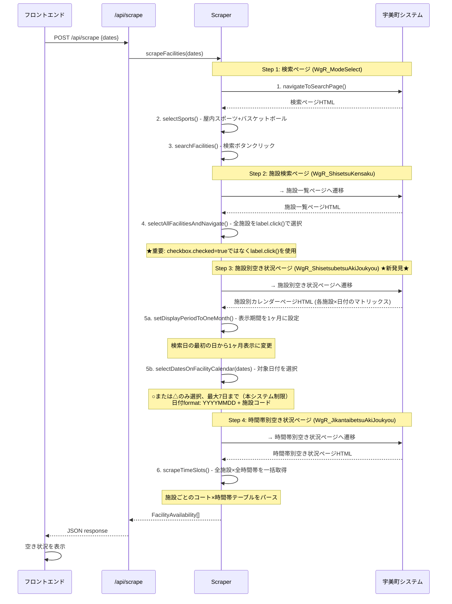

# Design Document

## 更新履歴

| 日付 | バージョン | 変更内容 |
|------|-----------|---------|
| 2025-12-07 | 2.4 | 本番環境デバッグとRender.com移行：タイムアウト延長、リトライロジック、デプロイプラットフォーム変更 |
| 2025-12-07 | 2.3 | 複数日選択時の日付ごとループ処理、「－」選択対応、戻るボタン処理を追加 |
| 2025-12-07 | 2.2 | UI改善と検索制限の追加：7日間制限、表示期間1ヶ月設定、連続空き時間サマリ |
| 2025-12-07 | 2.1 | タイムゾーン制約の追加、Step 4ページ構造の詳細化 |
| 2025-12-06 | 2.0 | Phase 2実装完了に伴う4ステップフローの反映 |
| 2025-12-05 | 1.0 | 初版作成 |

## 概要

宇美町施設予約検索システム（umi-facility-search）は、Next.js 15.x (App Router)を使用したモバイルファーストのWebアプリケーションです。本設計では、requirements.mdで定義された6つの主要要件を実現するための技術設計を詳細に定義します。

### システムの位置づけ

本システムは、既存の宇美町施設予約確認システムのデータソースとして利用し、ユーザーフレンドリーな代替インターフェースを提供します。スクレイピングによるデータ取得、モバイル最適化されたUI、適切なエラーハンドリングを実装します。

## ステアリングドキュメントとの整合性

### 技術標準 (tech.md)

本設計は、tech.mdで定義された技術スタックに完全準拠します：

- **Next.js 15.x (App Router)**: サーバーコンポーネントとクライアントコンポーネントの使い分け
- **TypeScript**: 100%型安全なコード
- **TailwindCSS**: モバイルファーストのレスポンシブデザイン
- **Puppeteer**: 信頼性の高いスクレイピング
- **pnpm 9.x**: パッケージ管理
- **Node.js 20.x**: Vercel推奨LTSバージョン

### プロジェクト構造 (structure.md)

本設計は、structure.mdで定義されたディレクトリ構造と命名規則に従います：

```
src/
├── app/                          # Next.js App Router
│   ├── page.tsx                 # トップページ（検索フォーム）
│   ├── api/
│   │   └── scrape/
│   │       └── route.ts         # スクレイピングAPI
│   └── results/
│       └── page.tsx             # 検索結果ページ
├── components/                   # Reactコンポーネント
│   ├── ui/                      # 汎用UIコンポーネント
│   ├── SearchForm.tsx
│   ├── FacilityCard.tsx
│   └── AvailabilityList.tsx
├── lib/                         # ビジネスロジック
│   ├── scraper/                # スクレイピング関連
│   ├── utils/                  # ユーティリティ関数
│   └── types/                  # TypeScript型定義
└── styles/
    └── globals.css
```

**命名規則:**
- コンポーネント: `PascalCase.tsx`
- ユーティリティ: `camelCase.ts`
- 型定義: `PascalCase`
- 関数: `camelCase`
- 定数: `UPPER_SNAKE_CASE`

## コード再利用分析

### 既存コンポーネントの活用

本プロジェクトは新規作成のため、既存コンポーネントはありません。ただし、以下の外部ライブラリを活用します：

- **Next.js組み込みコンポーネント**: `Link`, `Image`（最適化のため）
- **Headless UIライブラリ（将来検討）**: 日付ピッカー、モーダルなど
- **date-fns**: 日付操作（軽量で型安全）

### 統合ポイント

- **宇美町システム**: スクレイピングによるデータ取得（https://www.11489.jp/Umi/web/Home/WgR_ModeSelect）
- **Vercelデプロイ**: 環境変数による設定管理
- **将来的な拡張**: Vercel KV (Redis)によるキャッシュ（初期バージョンでは未実装）

## アーキテクチャ

### モジュラー設計原則

1. **単一ファイル責任**: 各ファイルは1つの明確な責任を持つ
2. **コンポーネント分離**: 小さく焦点を絞ったコンポーネントを作成
3. **サービスレイヤー分離**: データアクセス、ビジネスロジック、プレゼンテーションを分離
4. **ユーティリティモジュール化**: 単一目的の焦点を絞ったユーティリティ

### レイヤーアーキテクチャ


**依存関係の方向:**
- プレゼンテーション → ビジネスロジック → データアクセス → 外部サービス
- 下位レイヤーは上位レイヤーに依存しない

### レンダリング戦略

1. **検索フォーム（トップページ）**: クライアントサイドレンダリング（CSR）
   - ユーザーインタラクションが多い
   - `'use client'` ディレクティブを使用

2. **検索結果ページ**: サーバーサイドレンダリング（SSR）
   - APIからデータを取得して表示
   - SEOは不要だが、初回表示を高速化

3. **API Routes**: サーバーサイド
   - スクレイピング処理を実行
   - レート制限を実装

## コンポーネントとインターフェース

### 1. SearchForm コンポーネント

**目的**: 日付を選択して検索を実行するフォーム

**ファイル**: `src/components/SearchForm.tsx`

**Props:**
```typescript
interface SearchFormProps {
  onSubmit: (params: SearchParams) => void;
  isLoading?: boolean;
  initialDates?: Date[];      // エラー時の入力状態保持用
}

interface SearchParams {
  dates: Date[];           // 選択された日付の配列
}
```

**State:**
```typescript
const [selectedDates, setSelectedDates] = useState<Date[]>(initialDates);
const [validationError, setValidationError] = useState<string>('');
const [resetKey, setResetKey] = useState<number>(0); // リセット用のキー
```

**依存関係:**
- `DatePicker` (UI component)
- `QuickDateSelect` (UI component)

**再利用するもの:**
- TailwindCSSのモバイルファーストスタイル
- Reactのフォーム管理（useState）

**責任:**
- 日付選択UIの表示
- 「本日から1週間」クイックボタン
- バリデーション（日付未選択エラー）
- 検索パラメータの送信
- リセットボタンの表示とリセット機能
- エラー時の入力状態保持（initialDates経由）
- コンポーネント再マウントによる完全なリセット（resetKey使用）

### 2. DatePicker コンポーネント

**目的**: 複数日選択可能なカレンダーUI

**ファイル**: `src/components/ui/DatePicker.tsx`

**Props:**
```typescript
interface DatePickerProps {
  selectedDates: Date[];
  onChange: (dates: Date[]) => void;
  minDate?: Date;  // 過去日の選択を制限
}
```

**依存関係:**
- `date-fns` (日付計算)

**再利用するもの:**
- TailwindCSSグリッドレイアウト

**責任:**
- カレンダーグリッドの表示
- 複数日の選択/解除
- 選択された日付の視覚的な強調

### 3. QuickDateSelect コンポーネント

**目的**: 「本日から1週間」ボタンによるクイック日付選択

**ファイル**: `src/components/ui/QuickDateSelect.tsx`

**Props:**
```typescript
interface QuickDateSelectProps {
  onQuickSelect: (dates: Date[]) => void;
}
```

**依存関係:**
- `date-fns` (日付生成)

**責任:**
- 本日から7日間の配列を生成
- ボタンクリックでコールバック実行

### 4. LoadingSpinner コンポーネント

**目的**: ローディング状態の視覚表示

**ファイル**: `src/components/ui/LoadingSpinner.tsx`

**Props:**
```typescript
interface LoadingSpinnerProps {
  message?: string;  // 「施設情報を取得中...」など
}
```

**依存関係:** なし

**責任:**
- アニメーション付きスピナー表示
- 進行状況メッセージ表示

### 5. FacilityCard コンポーネント

**目的**: 施設情報と空き状況を表示するカード

**ファイル**: `src/components/FacilityCard.tsx`

**Props:**
```typescript
interface FacilityCardProps {
  facilityAvailability: FacilityAvailability;  // 統合型を使用
}

interface FacilityAvailability {
  facility: Facility;
  availability: AvailabilityData[];
}

interface Facility {
  id: string;
  name: string;
  type: 'basketball' | 'mini-basketball';
}

interface AvailabilityData {
  date: Date;
  slots: TimeSlot[];
}

interface CourtStatus {
  name: string;        // コート名（"全面", "倉庫側", "壁側"など）
  available: boolean;  // true = 空き, false = 空いていない
}

type AvailabilityStatus = 'all-available' | 'partially-available' | 'unavailable';

interface TimeSlot {
  time: string;                           // 時刻（"8:30", "9:00"など）
  available: boolean;                     // true = いずれかのコートが空き
  status: AvailabilityStatus;             // 空き状況のステータス
  courts: readonly CourtStatus[];         // コート別の空き状況
}
```

**依存関係:**
- `AvailabilityList` (子コンポーネント)
- `formatDate` (日付フォーマット関数)

**責任:**
- 施設名の表示
- ~~スポーツ種目の表示（バスケットボール/ミニバスケットボール）~~ **削除済み** - ユーザーにとって不要な情報
- 日付ごとの空き状況表示
- 展開/折りたたみ状態管理
- **コートごとの連続空き時間サマリ表示**（アコーディオンヘッダー内）
  - 各コート名と連続空き時間を表示（例: "倉庫側\n　8:30-14:00、16:30-21:30"）
  - 複数の連続空き時間はカンマ区切りで同じ行に表示
  - 空きがないコートは表示しない
- **空き状況データがない場合の外部リンク表示**
  - 「空き状況データがありません」メッセージ
  - 宇美町の公式サイトへのリンク（target="_blank"）
  - 外部リンクアイコンの表示

### 6. AvailabilityList コンポーネント

**目的**: ガントチャート風の空き状況表示（時間帯×コート）

**ファイル**: `src/components/AvailabilityList.tsx`

**Props:**
```typescript
interface AvailabilityListProps {
  slots: readonly TimeSlot[];  // 表示する時間帯のリスト
  dateLabel?: string;          // 日付文字列（表示用）
}
```

**依存関係:** なし

**責任:**
- テーブル形式での空き状況表示（時間×コート）
- 時間帯を縦軸、コート名を横軸に配置（最大3コート）
- 色分け表示（緑=○空き、グレー=×満）
- 凡例の表示

### 7. ErrorMessage コンポーネント

**目的**: エラーメッセージと再試行ボタンの表示

**ファイル**: `src/components/ui/ErrorMessage.tsx`

**Props:**
```typescript
interface ErrorMessageProps {
  type: 'network' | 'timeout' | 'scraping' | 'validation';
  onRetry?: () => void;
}
```

**依存関係:** なし

**責任:**
- エラータイプに応じたメッセージ表示
- 再試行ボタンの表示

### 8. API Route: /api/scrape

**目的**: スクレイピング処理を実行してデータを返す

**ファイル**: `src/app/api/scrape/route.ts`

**リクエスト:**
```typescript
interface ScrapeRequest {
  dates: string[];         // ISO 8601形式の日付配列（YYYY-MM-DD）
}
```

**レスポンス:**
```typescript
interface ScrapeResponse {
  facilities: FacilityAvailability[];
}

interface FacilityAvailability {
  facility: Facility;
  availability: AvailabilityData[];
}
```

**依存関係:**
- `scrapeFacilities` (lib/scraper)
- `rateLimiter` (lib/scraper/rateLimiter)

**責任:**
- リクエストのバリデーション
- スクレイピング実行
- レート制限の適用
- エラーハンドリング
- JSONレスポンスの返却


## データモデル

### Facility（施設）

```typescript
interface Facility {
  id: string;         // 施設の一意識別子
  name: string;       // 施設名（例: "宇美町立体育館"）
  type: 'basketball' | 'mini-basketball';  // スポーツ種目
}
```

### AvailabilityData（空き状況データ）

```typescript
interface AvailabilityData {
  date: Date;              // 対象日付
  slots: TimeSlot[];       // 時間帯ごとの空き状況
}
```

### TimeSlot（時間帯）

```typescript
interface CourtStatus {
  name: string;        // コート名（"全面", "倉庫側", "壁側"など）
  available: boolean;  // true = 空き, false = 空いていない
}

type AvailabilityStatus = 'all-available' | 'partially-available' | 'unavailable';

interface TimeSlot {
  time: string;                           // 時刻（"8:30", "9:00"など）
  available: boolean;                     // true = いずれかのコートが空き
  status: AvailabilityStatus;             // 空き状況のステータス
  courts: readonly CourtStatus[];         // コート別の空き状況
}
```

### SearchParams（検索パラメータ）

```typescript
interface SearchParams {
  dates: Date[];  // 検索対象日付の配列
}
```

### ScrapeRequest / ScrapeResponse（API型）

```typescript
// POST /api/scrape リクエスト
interface ScrapeRequest {
  dates: string[];  // YYYY-MM-DD形式の日付配列
}

// POST /api/scrape レスポンス
interface ScrapeResponse {
  facilities: FacilityAvailability[];
}

interface FacilityAvailability {
  facility: Facility;
  availability: AvailabilityData[];
}

// エラーレスポンス
interface ErrorResponse {
  error: string;
  message: string;
  retryable: boolean;
}
```

## スクレイピング設計

### 実装状況

**Phase 1 ✅ (実装完了)**
- 初期ページへのアクセス
- スポーツ種目の選択（バスケットボール/ミニバスケットボール）
- 施設一覧の取得（10件程度）

**Phase 2 ⏳ (実装中 - 必須機能)**
- 施設の選択（チェックボックス）
- 日付選択ページへの遷移
- カレンダーから日付を選択
- 時間帯別空き状況ページへの遷移
- 空き状況データの取得とパース

**実装の変更理由:**
Phase 2は当初「延期」としていましたが、以下の理由により必須機能として実装します:
1. 施設一覧ページの「本日の予定」セクションは常に空であり、データ取得不可
2. 空き状況を取得するには、日付選択→空き状況ページへの遷移が必須
3. 現在の不完全な実装ではユーザーに誤った情報を提供してしまう

詳細は `docs/investigation/implementation-gap-analysis.md` を参照

### スクレイピングフロー（Phase 2完全版 - 2025-12-06更新）

**重要な変更**: 調査により、実際のフローは以下の4ステップであることが判明しました。



**旧設計との主な違い:**

1. **Step 3（施設別空き状況ページ）の存在**
   - 旧設計では見落としていたページ
   - ここで日付を選択する（検索フォームに日付入力欄はない）
   - 各施設ごとにカレンダーが表示される

2. **フロー全体が1回の処理**
   - 旧設計: 施設ごと・日付ごとにループして複数回遷移
   - 新設計: 全施設選択 → 全日付選択 → 一括で空き状況取得

3. **チェックボックス選択方法**
   - 旧設計: `checkbox.checked = true; checkbox.click();`
   - 新設計: `label.click();` （イベントハンドラーの制約により必須）

### Scraper クラス

**ファイル**: `src/lib/scraper/index.ts`

**責任:**
- Puppeteerブラウザの起動
- ページナビゲーション
- HTML解析
- データ抽出（Phase 1: 施設一覧のみ）

**実装状況:**
- ✅ `navigateToSearchPage()` - 初期ページへのアクセス
- ✅ `selectSports()` - スポーツ種目の選択（AJAX対応、label要素クリック）
- ✅ `searchFacilities()` - 検索実行（searchMokuteki()関数呼び出し）
- ✅ `selectAllFacilities()` - 施設一覧取得（Phase 1版）
- ✅ `selectAllFacilitiesAndNavigate()` - 全施設選択+次へ進む（Phase 2完了）
- ✅ `selectDatesOnFacilityCalendar()` - 施設別空き状況ページで日付選択（Phase 2完了）
- ✅ `scrapeTimeSlots()` - 時間帯別空き状況の一括取得（Phase 2完了）
- ✅ `scrapeFacilities()` - 全体フローの統合実行（Phase 2完了）
- ❌ `selectFacilityAndNavigate()` - 削除予定（旧設計の誤認に基づくメソッド）
- ❌ `navigateBack()` - 不要（新フローでは戻る操作なし）

**Phase 2の重要な技術的発見:**
- チェックボックス選択は `label.click()` を使用（`checkbox.checked = true` は動作しない）
- 日付valueフォーマット: `YYYYMMDD` + 施設コード（例: "2025121100701   0"）
- 空き状況ラベル: ○（空き）、△（一部空き）のみ選択、×（満席）、－（対象外）、休（休館日）はスキップ
- 最大10日まで選択可能（システム制約）

**主要メソッド（Phase 2完了版）:**

```typescript
class FacilityScraper {
  private browser: Browser | null = null;

  /**
   * スクレイピング実行（Phase 2完了版 - 2025-12-06更新）
   *
   * @param dates - 対象日付の配列（最大10日）
   * @returns 施設ごとの空き状況
   */
  async scrapeFacilities(dates: Date[]): Promise<FacilityAvailability[]> {
    await this.initBrowser();

    try {
      const page = await this.browser!.newPage();

      // Step 1: 検索ページ
      await this.navigateToSearchPage(page);
      await this.selectSports(page);
      await this.searchFacilities(page);

      // Step 2: 施設検索ページ - 全施設を選択して次へ
      await this.selectAllFacilitiesAndNavigate(page);

      // Step 3: 施設別空き状況ページ - 対象日付を選択して次へ
      await this.selectDatesOnFacilityCalendar(page, dates);

      // Step 4: 時間帯別空き状況ページ - 空き状況を一括取得
      const availabilityData = await this.scrapeTimeSlots(page);

      return availabilityData;
    } finally {
      await this.closeBrowser();
    }
  }

  /**
   * Step 2: 全施設を選択して次へ進む
   * 重要: label.click()を使用（checkbox.checked=trueでは動作しない）
   */
  private async selectAllFacilitiesAndNavigate(page: Page): Promise<void> {
    const checkboxes = await page.$$('.shisetsu input[type="checkbox"][name="checkShisetsu"]');

    for (const checkbox of checkboxes) {
      const id = await checkbox.evaluate(el => el.id);
      await page.evaluate((id) => {
        const label = document.querySelector(`label[for="${id}"]`);
        if (label) label.click();
      }, id);
    }

    await page.click('.navbar .next > a');
    await page.waitForNavigation({ waitUntil: 'networkidle0' });
  }

  /**
   * Step 3: 施設別空き状況ページで日付を選択
   * 日付valueフォーマット: YYYYMMDD + 施設コード
   * ○または△のみ選択
   */
  private async selectDatesOnFacilityCalendar(page: Page, dates: Date[]): Promise<void> {
    const dateStrings = dates.map(date => format(date, 'yyyyMMdd'));

    await page.evaluate((dateStrings) => {
      const checkboxes = document.querySelectorAll('input[name="checkdate"]');

      checkboxes.forEach(checkbox => {
        const dateValue = checkbox.value.substring(0, 8);

        if (dateStrings.includes(dateValue)) {
          const label = document.querySelector(`label[for="${checkbox.id}"]`);
          const status = label?.textContent?.trim();

          // ○または△のみ選択
          if (status === '○' || status === '△') {
            label.click();
          }
        }
      });
    }, dateStrings);

    await page.click('.navbar .next > a');
    await page.waitForNavigation({ waitUntil: 'networkidle0' });
  }

  /**
   * Step 4: 時間帯別空き状況を一括取得
   *
   * 重要な実装ポイント:
   * - 各カレンダーテーブルから時間帯ヘッダーを抽出（3列目以降のth要素）
   * - 各コート行からコート名を抽出（td.shisetsu）
   * - 時間帯×コートのマトリックスで空き状況（○/×）を取得
   * - CourtStatus配列を生成し、AvailabilityStatusを計算
   * - 重複するカレンダー（同じ施設+日付）をMapでマージ
   */
  private async scrapeTimeSlots(page: Page, dates: Date[]): Promise<FacilityAvailability[]> {
    // 各施設のカレンダーを取得して解析
    // コート単位の詳細な空き状況を抽出
    // 詳細は実装ファイルを参照
  }

  /**
   * ブラウザ初期化
   */
  private async initBrowser(): Promise<void> {
    this.browser = await puppeteer.launch({
      headless: true,
      args: ['--no-sandbox', '--disable-setuid-sandbox']
    });
  }

  /**
   * 検索ページへのナビゲーション
   */
  private async navigateToSearchPage(page: Page): Promise<void> {
    await page.goto('https://www.11489.jp/Umi/web/Home/WgR_ModeSelect', {
      waitUntil: 'networkidle0',
      timeout: 10000
    });
  }

  /**
   * スポーツ種目選択（Phase 1実装完了）
   *
   * 重要な実装ポイント:
   * 1. AJAX読み込み待機: radioMokutekiSubmit()がAJAXでスポーツ種目を読み込む
   * 2. label要素クリック: カスタムUIのため、input要素ではなくlabel要素をクリック
   */
  private async selectSports(page: Page): Promise<void> {
    // 1. 屋内スポーツラジオボタンをクリック
    await page.evaluate(() => {
      const radio = document.querySelector('#radioPurposeLarge02') as HTMLInputElement;
      radio.checked = true;
      radio.click();
    });

    // 2. AJAX完了まで待機
    await page.waitForSelector('#checkPurposeMiddle505', { timeout: 15000 });
    await page.waitForFunction(() => {
      const checkbox = document.querySelector('#checkPurposeMiddle505');
      const parent = checkbox?.parentElement;
      return parent && window.getComputedStyle(parent).display !== 'none';
    }, { timeout: 15000 });

    await new Promise(resolve => setTimeout(resolve, 2000));

    // 3. label要素をクリック（input要素の直接クリックは不可）
    await page.evaluate(() => {
      const label505 = document.querySelector('label[for="checkPurposeMiddle505"]') as HTMLElement;
      const label510 = document.querySelector('label[for="checkPurposeMiddle510"]') as HTMLElement;
      label505.click();
      label510.click();
    });

    // 4. 選択確認
    const isSelected = await page.evaluate(() => {
      const checkbox505 = document.querySelector('#checkPurposeMiddle505') as HTMLInputElement;
      const checkbox510 = document.querySelector('#checkPurposeMiddle510') as HTMLInputElement;
      return checkbox505?.checked && checkbox510?.checked;
    });

    if (!isSelected) {
      throw new Error('チェックボックスの選択に失敗しました');
    }
  }

  /**
   * 検索実行（Phase 1実装完了）
   *
   * 重要な実装ポイント:
   * ボタンクリックではなく、searchMokuteki()関数を直接呼び出す
   */
  private async searchFacilities(page: Page): Promise<void> {
    const navigationPromise = page.waitForNavigation({
      waitUntil: 'networkidle0',
      timeout: 30000,
    });

    // searchMokuteki()関数を直接呼び出す
    await page.evaluate(() => {
      if (typeof (window as any).searchMokuteki === 'function') {
        (window as any).searchMokuteki();
      } else {
        throw new Error('searchMokuteki関数が見つかりません');
      }
    });

    await navigationPromise;

    // エラーチェック
    const errorMessage = await page.evaluate(() => {
      const dlg = document.querySelector('#messageDlg');
      if (dlg && window.getComputedStyle(dlg).display !== 'none') {
        const messageEl = dlg.querySelector('div p');
        return messageEl?.textContent || '';
      }
      return null;
    });

    if (errorMessage) {
      throw new Error(`検索に失敗しました: ${errorMessage}`);
    }
  }

  /**
   * 施設一覧取得（Phase 1実装完了）
   */
  private async selectAllFacilities(page: Page): Promise<Facility[]> {
    await page.waitForSelector('table#shisetsu', { timeout: 10000 });

    const facilities = await page.evaluate(() => {
      const checkboxes = Array.from(
        document.querySelectorAll('input[name="checkShisetsu"]')
      ) as HTMLInputElement[];

      return checkboxes.map((checkbox) => ({
        id: checkbox.value,
        name: checkbox.parentElement?.textContent?.trim() || '',
        type: 'basketball' as const  // バスケットボール固定
      }));
    });

    if (facilities.length === 0) {
      throw new Error('施設が見つかりませんでした');
    }

    console.log(`✅ ${facilities.length}件の施設を取得しました`);
    return facilities;
  }

  /**
   * ブラウザクローズ
   */
  private async closeBrowser(): Promise<void> {
    if (this.browser) {
      await this.browser.close();
      this.browser = null;
    }
  }
}
```

**Phase 2実装完了のまとめ:**

- ✅ 4ステップのスクレイピングフロー実装完了
- ✅ コート単位の詳細な空き状況取得
- ✅ 重複カレンダーのマージ処理実装
- ✅ CourtStatus / AvailabilityStatus型の導入

### HTMLParser

**ファイル**: `src/lib/scraper/parser.ts`

**責任:**
- HTMLからデータ抽出
- DOM要素の解析
- データ構造への変換

**主要関数:**

```typescript
/**
 * 施設一覧をHTMLから抽出
 */
export function parseFacilities(html: string): Facility[] {
  const $ = cheerio.load(html);
  const facilities: Facility[] = [];
  
  $('.facility-item').each((_, element) => {
    const id = $(element).attr('data-facility-id');
    const name = $(element).find('.facility-name').text();
    const type = $(element).attr('data-sport-type');
    
    if (id && name && type) {
      facilities.push({ id, name, type: type as any });
    }
  });
  
  return facilities;
}

/**
 * 空き状況をHTMLから抽出
 */
export function parseAvailability(html: string, date: Date): TimeSlot[] {
  const $ = cheerio.load(html);
  const slots: TimeSlot[] = [];
  
  $('.time-slot').each((_, element) => {
    const time = $(element).attr('data-time');
    const available = $(element).hasClass('available');
    
    if (time) {
      slots.push({ time, available });
    }
  });
  
  return slots;
}
```

### RateLimiter

**ファイル**: `src/lib/scraper/rateLimiter.ts`

**責任:**
- リクエスト間隔の制御
- 同時リクエスト数の制限

**実装:**

```typescript
class RateLimiter {
  private lastRequestTime: number = 0;
  private readonly MIN_INTERVAL = 5000; // 5秒
  private requestInProgress: boolean = false;

  /**
   * レート制限チェック
   */
  async checkRateLimit(): Promise<void> {
    // 同時リクエストチェック
    if (this.requestInProgress) {
      throw new Error('Another request is in progress');
    }

    // 最小間隔チェック
    const now = Date.now();
    const timeSinceLastRequest = now - this.lastRequestTime;
    
    if (timeSinceLastRequest < this.MIN_INTERVAL) {
      const waitTime = this.MIN_INTERVAL - timeSinceLastRequest;
      await this.sleep(waitTime);
    }

    this.requestInProgress = true;
    this.lastRequestTime = Date.now();
  }

  /**
   * リクエスト完了を通知
   */
  releaseRequest(): void {
    this.requestInProgress = false;
  }

  private sleep(ms: number): Promise<void> {
    return new Promise(resolve => setTimeout(resolve, ms));
  }
}

export const rateLimiter = new RateLimiter();
```


## エラーハンドリング

### エラーシナリオ

#### 1. ネットワークエラー

**説明**: インターネット接続が切断されている、または宇美町システムが応答しない

**処理方法:**
- 1回の自動再試行を実行
- 2回目も失敗した場合、エラーレスポンスを返す

**ユーザーへの影響:**
```typescript
{
  error: 'NetworkError',
  message: 'インターネット接続を確認してください',
  retryable: true
}
```

**実装:**
```typescript
async function fetchWithRetry(
  fn: () => Promise<any>,
  retries: number = 1
): Promise<any> {
  try {
    return await fn();
  } catch (error) {
    if (retries > 0) {
      await sleep(2000);
      return await fetchWithRetry(fn, retries - 1);
    }
    throw error;
  }
}
```

#### 2. タイムアウトエラー

**説明**: スクレイピング処理が10秒を超えた

**処理方法:**
- Puppeteerのタイムアウト設定（10秒）
- タイムアウト時にエラーを投げる

**ユーザーへの影響:**
```typescript
{
  error: 'TimeoutError',
  message: '処理に時間がかかっています。もう一度お試しください',
  retryable: true
}
```

**実装:**
```typescript
await page.goto(url, {
  waitUntil: 'networkidle0',
  timeout: 10000  // 10秒
});
```

#### 3. HTML構造変更エラー

**説明**: 宇美町システムのHTML構造が変更され、期待する要素が見つからない

**処理方法:**
- 要素の存在チェック
- 見つからない場合は具体的なエラーを投げる

**ユーザーへの影響:**
```typescript
{
  error: 'ScrapingError',
  message: 'データの取得に失敗しました。しばらく経ってから再度お試しください',
  retryable: false
}
```

**実装:**
```typescript
const element = await page.$('.expected-element');
if (!element) {
  throw new Error('HTML structure changed: .expected-element not found');
}
```

#### 4. バリデーションエラー

**説明**: ユーザーが日付を選択していない

**処理方法:**
- フロントエンドでバリデーション
- APIでも二重チェック

**ユーザーへの影響:**
```typescript
{
  error: 'ValidationError',
  message: '日付を選択してください',
  retryable: false
}
```

**実装:**
```typescript
// フロントエンド
if (selectedDates.length === 0) {
  setError('日付を選択してください');
  return;
}

// API
if (!dates || dates.length === 0) {
  return NextResponse.json(
    { error: 'ValidationError', message: '日付を選択してください' },
    { status: 400 }
  );
}
```

#### 5. レート制限エラー

**説明**: 5秒以内に連続してリクエストが送信された

**処理方法:**
- RateLimiterでチェック
- 429エラーを返す

**ユーザーへの影響:**
```typescript
{
  error: 'RateLimitError',
  message: 'しばらく待ってから再度お試しください',
  retryable: true
}
```

## テスト戦略

### ユニットテスト

requirements.mdに従い、TDDアプローチでユニットテストを実装します。

**テストフレームワーク**: Vitest

**テスト対象:**

1. **日付ユーティリティ** (`lib/utils/date.ts`)
   ```typescript
   describe('日付範囲生成', () => {
     it('本日から7日分の日付配列を生成できること', () => {
       const result = generateDateRange(new Date(), 7);
       expect(result).toHaveLength(7);
     });
   });
   ```

2. **バリデーション** (`lib/utils/validation.ts`)
   ```typescript
   describe('検索パラメータのバリデーション', () => {
     it('日付が空の配列の場合はエラーを投げること', () => {
       expect(() => validateSearchParams({ dates: [] })).toThrow();
     });

     it('日付が正常な場合はエラーを投げないこと', () => {
       expect(() => validateSearchParams({
         dates: [new Date()],
       })).not.toThrow();
     });
   });
   ```

3. **HTMLパーサー** (`lib/scraper/parser.ts`)
   ```typescript
   describe('施設情報のHTMLパース', () => {
     it('HTMLから施設情報を抽出できること', () => {
       const html = '<div class="facility-item" data-facility-id="1">...</div>';
       const facilities = parseFacilities(html);
       expect(facilities).toHaveLength(1);
     });
   });
   ```

4. **RateLimiter** (`lib/scraper/rateLimiter.ts`)
   ```typescript
   describe('レート制限', () => {
     it('5秒間隔を強制すること', async () => {
       const limiter = new RateLimiter();
       await limiter.checkRateLimit();
       const start = Date.now();
       await limiter.checkRateLimit();
       const duration = Date.now() - start;
       expect(duration).toBeGreaterThanOrEqual(5000);
     });
   });
   ```

**テストカバレッジ目標:**
- ビジネスロジック: 80%以上
- ユーティリティ関数: 90%以上

### E2Eテスト

requirements.mdに従い、初期バージョンではE2Eテストは実装しません。将来的な拡張として検討します。

## 非機能要件の実装

### パフォーマンス最適化

1. **初回表示時間（2秒以内）**
   - Next.js App Routerのサーバーコンポーネント活用
   - TailwindCSSのPurge設定（未使用CSS削除）
   - フォントの最適化（next/font）

2. **検索結果取得時間（10秒以内）**
   - Puppeteerのタイムアウト設定（10秒）
   - 並列処理の検討（複数施設の同時スクレイピング - 要検討）

3. **バンドルサイズ（300KB以下）**
   - Dynamic Importの活用
   - Tree Shakingの最適化
   - Puppeteerはサーバーサイドのみで使用

### セキュリティ対策

1. **HTTPS通信**
   - Vercelのデフォルト証明書を使用
   - すべてのリクエストをHTTPSで実行

2. **XSS対策**
   - Reactのデフォルトエスケープを活用
   - `dangerouslySetInnerHTML`は使用禁止

3. **スクレイピング先への配慮**
   - User-Agentヘッダーの設定
   ```typescript
   await page.setUserAgent(
     'Mozilla/5.0 (compatible; UmiFacilitySearch/1.0)'
   );
   ```
   - Rate Limiterによる5秒間隔の強制

4. **環境変数の管理**
   - `.env.local`でローカル環境変数を管理
   - センシティブ情報はVercelの環境変数として設定

### モバイル最適化

1. **タッチターゲットサイズ**
   - すべてのタップ可能な要素を44px × 44px以上に設定
   ```css
   .tap-target {
     min-width: 44px;
     min-height: 44px;
   }
   ```

2. **フォントサイズ**
   - 本文: 16px以上
   - 見出し: 階層的なサイズ（20px, 24px, 32px）

3. **レスポンシブデザイン**
   - TailwindCSSのブレークポイント活用
   ```tsx
   <div className="w-full sm:w-1/2 lg:w-1/3">
   ```

### 信頼性向上

1. **エラーバウンダリ**
   - Next.js App Routerの`error.tsx`を活用
   ```typescript
   // app/error.tsx
   'use client';
   
   export default function Error({
     error,
     reset,
   }: {
     error: Error;
     reset: () => void;
   }) {
     return (
       <div>
         <h2>エラーが発生しました</h2>
         <button onClick={reset}>再試行</button>
       </div>
     );
   }
   ```

2. **ローディング状態**
   - Next.js App Routerの`loading.tsx`を活用
   ```typescript
   // app/loading.tsx
   export default function Loading() {
     return <LoadingSpinner message="読み込み中..." />;
   }
   ```

3. **再試行ロジック**
   - ネットワークエラー時に1回の自動再試行
   - ユーザー操作による手動再試行ボタン

## デプロイ設計

### Render.comデプロイ設定（2025-12-07更新）

**重要な変更**: VercelからRender.comへ移行

**移行理由**:
- VercelのIPアドレスが宇美町施設予約システムのファイアウォールにブロックされることが判明
- 接続タイムアウト（net::ERR_CONNECTION_TIMED_OUT）が発生し、リトライ・User-Agent変更でも解決せず
- Render.comは異なるIPレンジを使用し、ブロックを回避できる見込み

**Render.com設定（予定）**:
- **サービスタイプ**: Web Service
- **ランタイム**: Node.js 20.x
- **ビルドコマンド**: `pnpm install && pnpm build`
- **起動コマンド**: `pnpm start`
- **環境変数**:
  - `NODE_ENV`: production
  - `NEXT_PUBLIC_APP_URL`: アプリケーションURL
- **無料枠制限**:
  - 750時間/月の稼働時間
  - 15分間アクティビティがないとスリープ（コールドスタート発生）
  - メモリ: 512MB

**Docker設定（必要に応じて）**:
Chromiumの動作が不安定な場合、Dockerfileを作成してカスタムイメージを使用:
```dockerfile
FROM node:20-slim
# Chromium依存関係のインストール
RUN apt-get update && apt-get install -y \
  chromium \
  && rm -rf /var/lib/apt/lists/*
ENV PUPPETEER_EXECUTABLE_PATH=/usr/bin/chromium
```

**~~旧Vercel設定~~（廃止）**:
```json
{
  "buildCommand": "pnpm build",
  "devCommand": "pnpm dev",
  "installCommand": "pnpm install",
  "framework": "nextjs",
  "regions": ["hnd1"],
  "functions": {
    "app/api/**/*.ts": {
      "memory": 1024,
      "maxDuration": 90
    }
  }
}
```

### ビルド最適化

**next.config.js:**
```javascript
/** @type {import('next').NextConfig} */
const nextConfig = {
  reactStrictMode: true,
  swcMinify: true,
  compress: true,
  poweredByHeader: false,
  
  // Puppeteer用の設定
  experimental: {
    serverComponentsExternalPackages: ['puppeteer']
  }
};

module.exports = nextConfig;
```

## Phase 2 新規メソッドの設計

---

## Phase 2調査結果と実装詳細（2025-12-06更新）

### 調査で判明した重要な事実

**問題の根本原因:**
1. 検索フォームに日付入力フィールドは存在しない
2. 中間ページ（Step 3: 施設別空き状況ページ）が存在する
3. チェックボックス選択は `label.click()` が必須

**正しいページ遷移フロー:**
```
Step 1: WgR_ModeSelect (検索ページ)
  ↓ スポーツ選択 + 検索ボタン
Step 2: WgR_ShisetsuKensaku (施設検索ページ)
  ↓ 全施設選択 + 次へ進む
Step 3: WgR_ShisetsubetsuAkiJoukyou (施設別空き状況ページ) ★重要★
  ↓ 日付選択 + 次へ進む
Step 4: WgR_JikantaibetsuAkiJoukyou (時間帯別空き状況ページ)
  ↓ 空き状況を取得
```

### セレクタ一覧（検証済み）

#### Step 2: 施設検索ページ
| 要素 | セレクタ | 備考 |
|------|---------|------|
| 施設チェックボックス | `.shisetsu input[type="checkbox"][name="checkShisetsu"]` | 全施設 |
| 施設ラベル | `label[for="checkShisetsu${facilityId}"]` | label.click()を使用 |
| 次へ進むボタン | `.navbar .next > a` | ページ遷移 |

#### Step 3: 施設別空き状況ページ
| 要素 | セレクタ | 備考 |
|------|---------|------|
| カレンダー（全施設分） | `.item .calendar` | 施設数分のカレンダー |
| 施設名 | `.item h3` | 施設名表示 |
| 日付チェックボックス | `input[type="checkbox"][name="checkdate"]` | 全日付 |
| 日付ラベル | `label[for="${checkboxId}"]` | ○△×－休 |
| 次へ進むボタン | `.navbar .next > a` | ページ遷移 |

**日付valueフォーマット:**
```
value="2025121100701   0"
      ^^^^^^^^ ^^^^^ ^^^
      日付     施設  不明
      YYYYMMDD コード
```

**空き状況ラベル:**
- `○`: 空きあり → 選択する
- `△`: 一部空き → 選択する
- `－`: 当日など → **選択する**（当日の場合に表示されるが、選択可能で空き状況が見られる）
- `×`: 空きなし → 選択しない
- `休`: 休館日 → disabled（選択不可）

#### Step 4: 時間帯別空き状況ページ

**重要な構造: 各カレンダーテーブルは1つの日付を表す**

当初の想定（複数日付が横に並ぶ）とは異なり、**各`.calendar`テーブルは1つの日付の時間帯データを表示**します。

| 要素 | セレクタ | 備考 |
|------|---------|------|
| カレンダー（全施設分） | `.item .calendar` | 施設ごと×日付ごとにテーブルが存在 |
| 日付ヘッダー | `.calendar thead th.shisetsu` | "2025年12月11日(水)" 形式 |
| 施設名 | `.item h3` | 施設名表示 |
| コート行 | `.calendar tbody tr` | 各コート（全面、倉庫側等） |
| コート名 | `.calendar tbody tr td:first-child` | コート名 |
| 時間帯ヘッダー | `.calendar thead th` (3列目以降) | "8:30～9:00" 形式 |
| 時間帯セル | `.calendar tbody tr td label` | ○（空き）、×（空いていない） |

**HTML構造の例:**
```html
<div class="item">
  <h3>宇美町立体育館</h3>

  <!-- 12/11のカレンダー -->
  <table class="calendar">
    <thead>
      <tr>
        <th class="shisetsu">2025年12月11日(水)</th>
        <th>定員</th>
        <th>8:30～9:00</th>
        <th>9:00～9:30</th>
        <!-- ... -->
      </tr>
    </thead>
    <tbody>
      <tr>
        <td>全面</td>
        <td>50</td>
        <td><label>○</label></td>
        <td><label>×</label></td>
        <!-- ... -->
      </tr>
    </tbody>
  </table>

  <!-- 12/12のカレンダー（別テーブル） -->
  <table class="calendar">
    <thead>
      <tr>
        <th class="shisetsu">2025年12月12日(木)</th>
        <!-- ... -->
      </tr>
    </thead>
    <!-- ... -->
  </table>
</div>
```

**パースロジック:**
1. 各`.calendar`テーブルをループ
2. `th.shisetsu`から日付を正規表現で抽出: `/(\d{4})年(\d{1,2})月(\d{1,2})日/`
3. 日付が対象日付に含まれるかチェック
4. 時間帯ヘッダー（3列目以降の`th`）から時刻を取得: "8:30～9:00" → "8:30-9:00"
5. 各コート行の該当セルから空き状況（○/×）を取得

### 実装上の重要ポイント

#### 1. チェックボックス選択は必ずlabel.click()

```typescript
// ❌ 動作しない方法
checkbox.checked = true;
checkbox.click();

// ✅ 動作する方法
const label = document.querySelector(`label[for="${checkbox.id}"]`);
label.click();
```

**理由**: チェックボックスのイベントハンドラーが `.checked` プロパティを強制的に `false` に戻すため

#### 2. 日付選択ロジック（日付ごとループ処理対応）

**重要**: 施設 × 日付の組み合わせが10個までの制限があるため、日付ごとにループして処理します。

```typescript
// 全体フロー: 日付ごとにループ
for (let i = 0; i < dates.length; i++) {
  const currentDate = dates[i];

  // 1. 既存の選択をクリア（戻るボタンで戻った場合に前回の選択が残っているため）
  await page.evaluate(() => {
    const checkboxes = Array.from(
      document.querySelectorAll('input[type="checkbox"][name="checkdate"]')
    ) as HTMLInputElement[];

    checkboxes.forEach((checkbox) => {
      if (checkbox.checked) {
        const label = document.querySelector(
          `label[for="${checkbox.id}"]`
        ) as HTMLElement;
        if (label) {
          label.click();
        }
      }
    });
  });

  // 2. 日付を選択
  await selectDatesOnFacilityCalendar(page, [currentDate]);

  // 3. データ取得
  const results = await scrapeTimeSlots(page, [currentDate]);
  allResults.push(...results);

  // 4. 最後以外は戻るボタンで施設別空き状況ページへ戻る
  if (i < dates.length - 1) {
    await goBackToFacilityCalendar(page);
  }
}

// 日付選択メソッド
private async selectDatesOnFacilityCalendar(page: Page, dates: Date[]): Promise<void> {
  // YYYYMMDD形式に変換
  const dateStrings = dates.map(date => format(date, 'yyyyMMdd'));

  await page.evaluate((dateStrings) => {
    const checkboxes = document.querySelectorAll('input[name="checkdate"]');

    checkboxes.forEach(checkbox => {
      // valueの最初の8文字が日付
      const checkboxDate = checkbox.value.substring(0, 8);

      if (dateStrings.includes(checkboxDate)) {
        const label = document.querySelector(`label[for="${checkbox.id}"]`);
        const status = label?.textContent?.trim();

        // ○、△、－を選択（空きあり、一部空き、当日など）
        // 注: －は当日の場合に表示されるが、選択可能で空き状況が見られる
        if (status === '○' || status === '△' || status === '－') {
          // チェックボックスが選択されていない場合のみクリック
          if (!checkbox.checked) {
            label.click();
          }
        }
      }
    });
  }, dateStrings);
}

// 戻るボタンで施設別空き状況ページへ戻る
private async goBackToFacilityCalendar(page: Page): Promise<void> {
  // ページ内の「前に戻る」ボタンをクリック（ブラウザバックではない）
  await Promise.all([
    page.waitForNavigation({ waitUntil: 'networkidle0', timeout: 10000 }),
    page.click('.navbar .prev > a'),
  ]);

  // 施設別空き状況ページ (WgR_ShisetsubetsuAkiJoukyou) に戻ったことを確認
  const currentUrl = page.url();
  if (!currentUrl.includes('WgR_ShisetsubetsuAkiJoukyou')) {
    throw new Error(`予期しないページに遷移しました: ${currentUrl}`);
  }
}
```

#### 3. 制約事項

- **施設 × 日付の組み合わせが10個まで** (システム制約)
  - 施設が10個ある場合、1回につき1日分しか選択できない
  - 複数日を取得する場合は、日付ごとにループして処理する必要がある
- **最大7日まで選択可能** (本システムの制限)
  - スクレイピング対象システムは最大10日まで選択可能
  - 本システムでは7日間に制限し、システムへの負荷を軽減
- **施設は全選択が前提** (個別選択は今後の改善案)
- **戻るボタンはページ内ボタンを使用**
  - ブラウザバック（`page.goBack()`）ではエラーになる
  - 必ずページ内の「前に戻る」ボタン（`.navbar .prev > a`）を使用すること
- **既存の選択をクリアする必要がある**
  - 戻るボタンで施設別空き状況ページに戻った際、前回の日付選択が残っている
  - 新しい日付を選択する前に、必ず既存の選択をクリアすること

#### 4. 日付のタイムゾーン問題に注意 ⚠️

JavaScriptの`Date.toISOString()`はUTC時刻を返すため、日本時間（UTC+9）で日付が1日ずれる問題が発生します。

**必ず`date-fns`の`format(date, 'yyyy-MM-dd')`を使用すること:**

```typescript
// ❌ NG: UTC変換により日付がずれる
const dateStr = date.toISOString().split('T')[0];
// 2025-12-11 00:00:00 JST → 2025-12-10 15:00:00 UTC → "2025-12-10"

// ✅ OK: ローカルタイムで正しい日付
import { format } from 'date-fns';
const dateStr = format(date, 'yyyy-MM-dd');
// 2025-12-11 00:00:00 JST → "2025-12-11"
```

**影響範囲:**
- フロントエンド → API のリクエスト時 (src/app/page.tsx:39)
- スクレイピング時の日付フォーマット (src/lib/scraper/index.ts)

### エラーハンドリング

```typescript
// ダイアログの自動受け入れ
page.on('dialog', async dialog => {
  console.log('ダイアログ:', dialog.message());
  await dialog.accept();
});

// タイムアウト処理
try {
  await page.waitForNavigation({
    waitUntil: 'networkidle0',
    timeout: 10000
  });
} catch (error) {
  throw new Error(`ページ遷移タイムアウト: ${error.message}`);
}
```

### 関連ドキュメント

詳細な調査結果は以下のドキュメントを参照:
- `investigation/complete-flow-analysis.md` - 完全なフロー調査結果
- `investigation/INVESTIGATION_SUMMARY.md` - 調査結果サマリー
- `../../../docs/design/scraping-flow-design.md` - スクレイピングフロー設計書（詳細版）
- `../../../docs/tasks/implementation-tasks.md` - 実装タスク一覧（5フェーズ）

## 本番環境デバッグと最適化（2025-12-07）

### Vercel本番環境での問題と対策

#### 問題1: ナビゲーションタイムアウト（解決済み）
**症状**: Step 2（施設選択・遷移）で30秒タイムアウト

**原因**:
- `waitUntil: 'networkidle0'` がVercel環境で遅い
- 30秒のタイムアウトが不十分

**対策**:
- `waitUntil: 'domcontentloaded'` に変更（より高速）
- タイムアウトを30秒→60秒に延長（src/lib/scraper/index.ts:478）
- vercel.json の maxDuration を60秒→90秒に延長

#### 問題2: Read-only File System（解決済み）
**症状**: デバッグ用スクリーンショット保存時にEROFSエラー

**原因**: Vercelのサーバーレス環境はファイルシステムが読み取り専用（/tmpのみ書き込み可）

**対策**: デバッグ用スクリーンショットをコメントアウト（src/lib/scraper/index.ts:563-565）

#### 問題3: 接続タイムアウト（**未解決・致命的**）
**症状**:
- Step 1（初回ページアクセス）で `net::ERR_CONNECTION_TIMED_OUT`
- 3回のリトライすべてが15秒でタイムアウト
- 合計50秒以上かけても接続失敗

**原因分析**:
- VercelのIPアドレスレンジが宇美町施設予約システムのファイアウォールにブロックされている
- TCP接続レベルでの拒否のため、アプリケーション層での対策は無効

**試行した対策（すべて失敗）**:
1. ✗ リトライロジック追加（3回試行、2秒間隔）
2. ✗ User-Agent変更（カスタム→標準ブラウザ）
3. ✗ タイムアウト延長

**結論**: **Vercelでは本番運用不可能** → Render.comへ移行

### Render.comへの移行決定

**選定理由**:
1. 異なるIPアドレスレンジでファイアウォールブロックを回避できる見込み
2. 実行時間制限なし（Vercelは90秒上限）
3. 無料枠で750時間/月の稼働時間
4. Dockerサポートによる柔軟なChromium環境構築

**代替案との比較**:
- Netlify: ✗ 実行時間制限が短い（10-26秒）
- Heroku: ✗ 無料枠廃止（最低$50/月）
- Fly.io: △ 東京リージョンあるが、メモリ制限とコスト面でRender.comを優先

### スクレイピング最適化まとめ

**実装済みの最適化**:
1. **ナビゲーション戦略**: `networkidle0` → `domcontentloaded`（高速化）
2. **タイムアウト設定**: 30秒 → 60秒（余裕を持たせる）
3. **リトライロジック**: 3回試行、2秒間隔（ネットワーク一時エラー対策）
4. **User-Agent**: 標準ブラウザ（ブロック回避）
5. **デバッグ機能**: 本番環境ではスクリーンショット無効化

**コード変更箇所**:
- `src/lib/scraper/index.ts`:
  - L189-224: リトライロジック付きnavigateToSearchPage
  - L478: ナビゲーション戦略とタイムアウト変更
  - L563-565: スクリーンショット無効化
- `vercel.json`:
  - L11: maxDuration 60 → 90

## まとめ

本設計ドキュメントは、requirements.mdで定義されたすべての要件を実現するための技術設計を詳細に定義しました。

**主要な設計決定:**
1. Next.js 15.x App Routerの活用
2. モジュラーなコンポーネント設計
3. Puppeteerによる信頼性の高いスクレイピング
4. TDDアプローチによるユニットテスト
5. モバイルファーストのレスポンシブデザイン
6. **Render.comでのホスティング**（Vercelから変更）

**Phase 2実装完了 (2025-12-06):**
- ✅ 4ステップの完全なスクレイピングフロー実装
- ✅ 施設別空き状況ページ（Step 3）の発見と実装
- ✅ label.click()パターンの適用
- ✅ 日付選択ロジックの実装
- ✅ 時間帯別空き状況の一括取得

**本番環境デバッグ完了 (2025-12-07):**
- ✅ ナビゲーションタイムアウト解決
- ✅ Read-only File System対策
- ✅ リトライロジック実装
- ✅ VercelのIPブロック問題を特定
- ✅ Render.comへの移行決定

**重要な技術的発見:**
- チェックボックス選択は `label.click()` が必須
- 日付valueフォーマット: `YYYYMMDD` + 施設コード
- 空き状況ラベル（○△×－休）による選択フィルタリング
- 最大10日まで選択可能（システム制約）
- **VercelのIPアドレスが宇美町システムにブロックされる**（致命的）

**次のステップ:**
- Render.comへのデプロイ設定
- 本番環境での動作確認（IPブロック回避の検証）
- パフォーマンス最適化
- エラーハンドリングの強化
