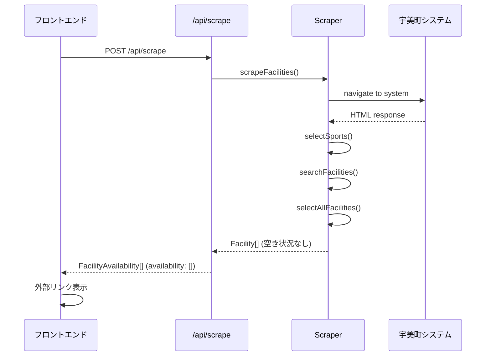

# Design Document

## 概要

宇美町施設予約検索システム（umi-facility-search）は、Next.js 15.x (App Router)を使用したモバイルファーストのWebアプリケーションです。本設計では、requirements.mdで定義された6つの主要要件を実現するための技術設計を詳細に定義します。

### システムの位置づけ

本システムは、既存の宇美町施設予約確認システムのデータソースとして利用し、ユーザーフレンドリーな代替インターフェースを提供します。スクレイピングによるデータ取得、モバイル最適化されたUI、適切なエラーハンドリングを実装します。

## ステアリングドキュメントとの整合性

### 技術標準 (tech.md)

本設計は、tech.mdで定義された技術スタックに完全準拠します：

- **Next.js 15.x (App Router)**: サーバーコンポーネントとクライアントコンポーネントの使い分け
- **TypeScript**: 100%型安全なコード
- **TailwindCSS**: モバイルファーストのレスポンシブデザイン
- **Puppeteer**: 信頼性の高いスクレイピング
- **pnpm 9.x**: パッケージ管理
- **Node.js 20.x**: Vercel推奨LTSバージョン

### プロジェクト構造 (structure.md)

本設計は、structure.mdで定義されたディレクトリ構造と命名規則に従います：

```
src/
├── app/                          # Next.js App Router
│   ├── page.tsx                 # トップページ（検索フォーム）
│   ├── api/
│   │   └── scrape/
│   │       └── route.ts         # スクレイピングAPI
│   └── results/
│       └── page.tsx             # 検索結果ページ
├── components/                   # Reactコンポーネント
│   ├── ui/                      # 汎用UIコンポーネント
│   ├── SearchForm.tsx
│   ├── FacilityCard.tsx
│   └── AvailabilityList.tsx
├── lib/                         # ビジネスロジック
│   ├── scraper/                # スクレイピング関連
│   ├── utils/                  # ユーティリティ関数
│   └── types/                  # TypeScript型定義
└── styles/
    └── globals.css
```

**命名規則:**
- コンポーネント: `PascalCase.tsx`
- ユーティリティ: `camelCase.ts`
- 型定義: `PascalCase`
- 関数: `camelCase`
- 定数: `UPPER_SNAKE_CASE`

## コード再利用分析

### 既存コンポーネントの活用

本プロジェクトは新規作成のため、既存コンポーネントはありません。ただし、以下の外部ライブラリを活用します：

- **Next.js組み込みコンポーネント**: `Link`, `Image`（最適化のため）
- **Headless UIライブラリ（将来検討）**: 日付ピッカー、モーダルなど
- **date-fns**: 日付操作（軽量で型安全）

### 統合ポイント

- **宇美町システム**: スクレイピングによるデータ取得（https://www.11489.jp/Umi/web/Home/WgR_ModeSelect）
- **Vercelデプロイ**: 環境変数による設定管理
- **将来的な拡張**: Vercel KV (Redis)によるキャッシュ（初期バージョンでは未実装）

## アーキテクチャ

### モジュラー設計原則

1. **単一ファイル責任**: 各ファイルは1つの明確な責任を持つ
2. **コンポーネント分離**: 小さく焦点を絞ったコンポーネントを作成
3. **サービスレイヤー分離**: データアクセス、ビジネスロジック、プレゼンテーションを分離
4. **ユーティリティモジュール化**: 単一目的の焦点を絞ったユーティリティ

### レイヤーアーキテクチャ


**依存関係の方向:**
- プレゼンテーション → ビジネスロジック → データアクセス → 外部サービス
- 下位レイヤーは上位レイヤーに依存しない

### レンダリング戦略

1. **検索フォーム（トップページ）**: クライアントサイドレンダリング（CSR）
   - ユーザーインタラクションが多い
   - `'use client'` ディレクティブを使用

2. **検索結果ページ**: サーバーサイドレンダリング（SSR）
   - APIからデータを取得して表示
   - SEOは不要だが、初回表示を高速化

3. **API Routes**: サーバーサイド
   - スクレイピング処理を実行
   - レート制限を実装

## コンポーネントとインターフェース

### 1. SearchForm コンポーネント

**目的**: 日付と時間帯を選択して検索を実行するフォーム

**ファイル**: `src/components/SearchForm.tsx`

**Props:**
```typescript
interface SearchFormProps {
  onSubmit: (params: SearchParams) => void;
  isLoading?: boolean;
  initialDates?: Date[];      // NEW: エラー時の入力状態保持用
  initialTimeRange?: TimeRange;  // NEW: エラー時の入力状態保持用
}

interface SearchParams {
  dates: Date[];           // 選択された日付の配列
  timeRange?: TimeRange;   // オプションの時間範囲
}

interface TimeRange {
  from: string;  // 開始時刻（例: "9:00"）
  to: string;    // 終了時刻（例: "12:00"）
}
```

**State:**
```typescript
const [selectedDates, setSelectedDates] = useState<Date[]>(initialDates);
const [timeRange, setTimeRange] = useState<TimeRange | undefined>(initialTimeRange);
const [validationError, setValidationError] = useState<string>('');
const [resetKey, setResetKey] = useState<number>(0); // NEW: リセット用のキー
```

**依存関係:**
- `DatePicker` (UI component)
- `TimePicker` (UI component)
- `QuickDateSelect` (UI component)
- `Button` (UI component)

**再利用するもの:**
- TailwindCSSのモバイルファーストスタイル
- Reactのフォーム管理（useState）

**責任:**
- 日付選択UIの表示
- 「本日から1週間」クイックボタン
- バリデーション（日付未選択エラー）
- 検索パラメータの送信
- **NEW: リセットボタンの表示とリセット機能**
- **NEW: エラー時の入力状態保持（initialDates/initialTimeRange経由）**
- **NEW: コンポーネント再マウントによる完全なリセット（resetKey使用）**

### 2. DatePicker コンポーネント

**目的**: 複数日選択可能なカレンダーUI

**ファイル**: `src/components/ui/DatePicker.tsx`

**Props:**
```typescript
interface DatePickerProps {
  selectedDates: Date[];
  onChange: (dates: Date[]) => void;
  minDate?: Date;  // 過去日の選択を制限
}
```

**依存関係:**
- `date-fns` (日付計算)

**再利用するもの:**
- TailwindCSSグリッドレイアウト

**責任:**
- カレンダーグリッドの表示
- 複数日の選択/解除
- 選択された日付の視覚的な強調

### 3. QuickDateSelect コンポーネント

**目的**: 「本日から1週間」ボタンによるクイック日付選択

**ファイル**: `src/components/ui/QuickDateSelect.tsx`

**Props:**
```typescript
interface QuickDateSelectProps {
  onQuickSelect: (dates: Date[]) => void;
}
```

**依存関係:**
- `date-fns` (日付生成)

**責任:**
- 本日から7日間の配列を生成
- ボタンクリックでコールバック実行

### 4. TimePicker コンポーネント

**目的**: 時間範囲選択UI（From - To）

**ファイル**: `src/components/ui/TimePicker.tsx`

**Props:**
```typescript
interface TimePickerProps {
  selectedRange?: TimeRange;
  onChange: (range: TimeRange | undefined) => void;
}

interface TimeRange {
  from: string;  // 開始時刻（例: "9:00"）
  to: string;    // 終了時刻（例: "12:00"）
}
```

**依存関係:** なし

**責任:**
- 開始時刻（From）のドロップダウン表示（8:30, 9:00, 9:30, ...）
- 終了時刻（To）のドロップダウン表示（8:30, 9:00, 9:30, ...）
- バリデーション（Toは From より後の時刻であること）
- 未選択 = 全時間帯検索

### 5. LoadingSpinner コンポーネント

**目的**: ローディング状態の視覚表示

**ファイル**: `src/components/ui/LoadingSpinner.tsx`

**Props:**
```typescript
interface LoadingSpinnerProps {
  message?: string;  // 「施設情報を取得中...」など
}
```

**依存関係:** なし

**責任:**
- アニメーション付きスピナー表示
- 進行状況メッセージ表示

### 6. FacilityCard コンポーネント

**目的**: 施設情報と空き状況を表示するカード

**ファイル**: `src/components/FacilityCard.tsx`

**Props:**
```typescript
interface FacilityCardProps {
  facilityAvailability: FacilityAvailability;  // 統合型を使用
}

interface FacilityAvailability {
  facility: Facility;
  availability: AvailabilityData[];
}

interface Facility {
  id: string;
  name: string;
  type: 'basketball' | 'mini-basketball';
}

interface AvailabilityData {
  date: Date;
  slots: TimeSlot[];
}

interface TimeSlot {
  startTime: string;   // "08:30"
  endTime: string;     // "09:00"
  available: boolean;  // true = 空き, false = 空いていない
}
```

**依存関係:**
- `AvailabilityList` (子コンポーネント)
- `formatDate` (日付フォーマット関数)

**責任:**
- 施設名の表示
- スポーツ種目の表示（バスケットボール/ミニバスケットボール）
- 日付ごとの空き状況表示
- 展開/折りたたみ状態管理
- **NEW: 空き状況データがない場合の外部リンク表示**
  - 「空き状況データがありません」メッセージ
  - 宇美町の公式サイトへのリンク（target="_blank"）
  - 外部リンクアイコンの表示

### 7. AvailabilityList コンポーネント

**目的**: 時間帯ごとの空き状況リスト

**ファイル**: `src/components/AvailabilityList.tsx`

**Props:**
```typescript
interface AvailabilityListProps {
  slots: TimeSlot[];
  showAll: boolean;  // true = 全時間帯, false = 空きのみ
  onToggle: () => void;
}
```

**依存関係:** なし

**責任:**
- 時間帯リストの表示
- 空き/空いていないの視覚的区別
- 展開ボタンの表示

### 8. ErrorMessage コンポーネント

**目的**: エラーメッセージと再試行ボタンの表示

**ファイル**: `src/components/ui/ErrorMessage.tsx`

**Props:**
```typescript
interface ErrorMessageProps {
  type: 'network' | 'timeout' | 'scraping' | 'validation';
  onRetry?: () => void;
}
```

**依存関係:** なし

**責任:**
- エラータイプに応じたメッセージ表示
- 再試行ボタンの表示

### 9. API Route: /api/scrape

**目的**: スクレイピング処理を実行してデータを返す

**ファイル**: `src/app/api/scrape/route.ts`

**リクエスト:**
```typescript
interface ScrapeRequest {
  dates: string[];         // ISO 8601形式の日付配列
  timeRange?: TimeRange;   // オプションの時間範囲
}

interface TimeRange {
  from: string;  // 開始時刻（例: "9:00"）
  to: string;    // 終了時刻（例: "12:00"）
}
```

**レスポンス:**
```typescript
interface ScrapeResponse {
  facilities: FacilityAvailability[];
}

interface FacilityAvailability {
  facility: Facility;
  availability: AvailabilityData[];
}
```

**依存関係:**
- `scrapeFacilities` (lib/scraper)
- `rateLimiter` (lib/scraper/rateLimiter)

**責任:**
- リクエストのバリデーション
- スクレイピング実行
- レート制限の適用
- エラーハンドリング
- JSONレスポンスの返却


## データモデル

### Facility（施設）

```typescript
interface Facility {
  id: string;         // 施設の一意識別子
  name: string;       // 施設名（例: "宇美町立体育館"）
  type: 'basketball' | 'mini-basketball';  // スポーツ種目
}
```

### AvailabilityData（空き状況データ）

```typescript
interface AvailabilityData {
  date: Date;              // 対象日付
  slots: TimeSlot[];       // 時間帯ごとの空き状況
}
```

### TimeSlot（時間帯）

```typescript
interface TimeSlot {
  time: string;        // 時刻（"8:30", "9:00", etc.）
  available: boolean;  // true = 空き, false = 空いていない
}
```

### SearchParams（検索パラメータ）

```typescript
interface SearchParams {
  dates: Date[];           // 検索対象日付の配列
  timeRange?: TimeRange;   // 指定時間範囲（オプション）
}

interface TimeRange {
  from: string;  // 開始時刻（例: "9:00"）
  to: string;    // 終了時刻（例: "12:00"）
}
```

### ScrapeRequest / ScrapeResponse（API型）

```typescript
// POST /api/scrape リクエスト
interface ScrapeRequest {
  dates: string[];         // ISO 8601形式の日付配列
  timeRange?: TimeRange;   // オプションの時間範囲
}

interface TimeRange {
  from: string;  // 開始時刻（例: "9:00"）
  to: string;    // 終了時刻（例: "12:00"）
}

// POST /api/scrape レスポンス
interface ScrapeResponse {
  facilities: FacilityAvailability[];
}

interface FacilityAvailability {
  facility: Facility;
  availability: AvailabilityData[];
}

// エラーレスポンス
interface ErrorResponse {
  error: string;
  message: string;
  retryable: boolean;
}
```

## スクレイピング設計

### 実装状況

**Phase 1 ✅ (実装完了)**
- 初期ページへのアクセス
- スポーツ種目の選択（バスケットボール/ミニバスケットボール）
- 施設一覧の取得（10件程度）

**Phase 2 ⏸️ (延期)**
- 日付と施設の選択
- 空き状況の詳細取得

**現在の動作:**
- 検索を実行すると、施設一覧（10件程度）が取得される
- 各施設カードには「空き状況データがありません」と表示される
- 宇美町の公式サイトへのリンクが提供され、ユーザーはそこで詳細を確認できる

### スクレイピングフロー（Phase 1実装版）



### Scraper クラス

**ファイル**: `src/lib/scraper/index.ts`

**責任:**
- Puppeteerブラウザの起動
- ページナビゲーション
- HTML解析
- データ抽出（Phase 1: 施設一覧のみ）

**実装状況:**
- ✅ `navigateToSearchPage()` - 初期ページへのアクセス
- ✅ `selectSports()` - スポーツ種目の選択（AJAX対応、label要素クリック）
- ✅ `searchFacilities()` - 検索実行（searchMokuteki()関数呼び出し）
- ✅ `selectAllFacilities()` - 施設一覧取得
- ⏸️ `selectDateAndFacility()` - Phase 2で実装予定
- ⏸️ `scrapeAvailability()` - Phase 2で実装予定

**主要メソッド（Phase 1実装版）:**

```typescript
class FacilityScraper {
  private browser: Browser | null = null;

  /**
   * スクレイピング実行（Phase 1版）
   */
  async scrapeFacilities(): Promise<FacilityAvailability[]> {
    await this.initBrowser();

    try {
      const page = await this.browser!.newPage();

      // Phase 1: 施設一覧まで取得
      await this.navigateToSearchPage(page);
      await this.selectSports(page);
      await this.searchFacilities(page);
      const facilities = await this.selectAllFacilities(page);

      // Phase 1では空き状況は空配列
      const results: FacilityAvailability[] = facilities.map(facility => ({
        facility,
        availability: []  // Phase 2で実装予定
      }));

      return results;
    } finally {
      await this.closeBrowser();
    }
  }

  /**
   * ブラウザ初期化
   */
  private async initBrowser(): Promise<void> {
    this.browser = await puppeteer.launch({
      headless: true,
      args: ['--no-sandbox', '--disable-setuid-sandbox']
    });
  }

  /**
   * 検索ページへのナビゲーション
   */
  private async navigateToSearchPage(page: Page): Promise<void> {
    await page.goto('https://www.11489.jp/Umi/web/Home/WgR_ModeSelect', {
      waitUntil: 'networkidle0',
      timeout: 10000
    });
  }

  /**
   * スポーツ種目選択（Phase 1実装完了）
   *
   * 重要な実装ポイント:
   * 1. AJAX読み込み待機: radioMokutekiSubmit()がAJAXでスポーツ種目を読み込む
   * 2. label要素クリック: カスタムUIのため、input要素ではなくlabel要素をクリック
   */
  private async selectSports(page: Page): Promise<void> {
    // 1. 屋内スポーツラジオボタンをクリック
    await page.evaluate(() => {
      const radio = document.querySelector('#radioPurposeLarge02') as HTMLInputElement;
      radio.checked = true;
      radio.click();
    });

    // 2. AJAX完了まで待機
    await page.waitForSelector('#checkPurposeMiddle505', { timeout: 15000 });
    await page.waitForFunction(() => {
      const checkbox = document.querySelector('#checkPurposeMiddle505');
      const parent = checkbox?.parentElement;
      return parent && window.getComputedStyle(parent).display !== 'none';
    }, { timeout: 15000 });

    await new Promise(resolve => setTimeout(resolve, 2000));

    // 3. label要素をクリック（input要素の直接クリックは不可）
    await page.evaluate(() => {
      const label505 = document.querySelector('label[for="checkPurposeMiddle505"]') as HTMLElement;
      const label510 = document.querySelector('label[for="checkPurposeMiddle510"]') as HTMLElement;
      label505.click();
      label510.click();
    });

    // 4. 選択確認
    const isSelected = await page.evaluate(() => {
      const checkbox505 = document.querySelector('#checkPurposeMiddle505') as HTMLInputElement;
      const checkbox510 = document.querySelector('#checkPurposeMiddle510') as HTMLInputElement;
      return checkbox505?.checked && checkbox510?.checked;
    });

    if (!isSelected) {
      throw new Error('チェックボックスの選択に失敗しました');
    }
  }

  /**
   * 検索実行（Phase 1実装完了）
   *
   * 重要な実装ポイント:
   * ボタンクリックではなく、searchMokuteki()関数を直接呼び出す
   */
  private async searchFacilities(page: Page): Promise<void> {
    const navigationPromise = page.waitForNavigation({
      waitUntil: 'networkidle0',
      timeout: 30000,
    });

    // searchMokuteki()関数を直接呼び出す
    await page.evaluate(() => {
      if (typeof (window as any).searchMokuteki === 'function') {
        (window as any).searchMokuteki();
      } else {
        throw new Error('searchMokuteki関数が見つかりません');
      }
    });

    await navigationPromise;

    // エラーチェック
    const errorMessage = await page.evaluate(() => {
      const dlg = document.querySelector('#messageDlg');
      if (dlg && window.getComputedStyle(dlg).display !== 'none') {
        const messageEl = dlg.querySelector('div p');
        return messageEl?.textContent || '';
      }
      return null;
    });

    if (errorMessage) {
      throw new Error(`検索に失敗しました: ${errorMessage}`);
    }
  }

  /**
   * 施設一覧取得（Phase 1実装完了）
   */
  private async selectAllFacilities(page: Page): Promise<Facility[]> {
    await page.waitForSelector('table#shisetsu', { timeout: 10000 });

    const facilities = await page.evaluate(() => {
      const checkboxes = Array.from(
        document.querySelectorAll('input[name="checkShisetsu"]')
      ) as HTMLInputElement[];

      return checkboxes.map((checkbox) => ({
        id: checkbox.value,
        name: checkbox.parentElement?.textContent?.trim() || '',
        type: 'basketball' as const  // バスケットボール固定
      }));
    });

    if (facilities.length === 0) {
      throw new Error('施設が見つかりませんでした');
    }

    console.log(`✅ ${facilities.length}件の施設を取得しました`);
    return facilities;
  }

  /**
   * ブラウザクローズ
   */
  private async closeBrowser(): Promise<void> {
    if (this.browser) {
      await this.browser.close();
      this.browser = null;
    }
  }
}
```

**Phase 2で実装予定のメソッド:**

```typescript
/**
 * 日付と施設の選択（Phase 2）
 */
private async selectDateAndFacility(
  page: Page,
  facility: Facility,
  dates: Date[]
): Promise<void> {
  // 施設選択
  // 日付選択ページへ遷移
  // 指定日付を選択
  // 次へ進むボタンをクリック
}

/**
 * 空き状況スクレイピング（Phase 2）
 */
private async scrapeAvailability(
  page: Page,
  dates: Date[],
  timeRange?: TimeRange
): Promise<AvailabilityData[]> {
  // 時間帯テーブルから空き状況を抽出
  // ◯（空き）、△（やや空き）、✕（空いていない）を判定
  // timeRangeが指定されている場合は、from-toの範囲のみフィルタリング
}
```

### HTMLParser

**ファイル**: `src/lib/scraper/parser.ts`

**責任:**
- HTMLからデータ抽出
- DOM要素の解析
- データ構造への変換

**主要関数:**

```typescript
/**
 * 施設一覧をHTMLから抽出
 */
export function parseFacilities(html: string): Facility[] {
  const $ = cheerio.load(html);
  const facilities: Facility[] = [];
  
  $('.facility-item').each((_, element) => {
    const id = $(element).attr('data-facility-id');
    const name = $(element).find('.facility-name').text();
    const type = $(element).attr('data-sport-type');
    
    if (id && name && type) {
      facilities.push({ id, name, type: type as any });
    }
  });
  
  return facilities;
}

/**
 * 空き状況をHTMLから抽出
 */
export function parseAvailability(html: string, date: Date): TimeSlot[] {
  const $ = cheerio.load(html);
  const slots: TimeSlot[] = [];
  
  $('.time-slot').each((_, element) => {
    const time = $(element).attr('data-time');
    const available = $(element).hasClass('available');
    
    if (time) {
      slots.push({ time, available });
    }
  });
  
  return slots;
}
```

### RateLimiter

**ファイル**: `src/lib/scraper/rateLimiter.ts`

**責任:**
- リクエスト間隔の制御
- 同時リクエスト数の制限

**実装:**

```typescript
class RateLimiter {
  private lastRequestTime: number = 0;
  private readonly MIN_INTERVAL = 5000; // 5秒
  private requestInProgress: boolean = false;

  /**
   * レート制限チェック
   */
  async checkRateLimit(): Promise<void> {
    // 同時リクエストチェック
    if (this.requestInProgress) {
      throw new Error('Another request is in progress');
    }

    // 最小間隔チェック
    const now = Date.now();
    const timeSinceLastRequest = now - this.lastRequestTime;
    
    if (timeSinceLastRequest < this.MIN_INTERVAL) {
      const waitTime = this.MIN_INTERVAL - timeSinceLastRequest;
      await this.sleep(waitTime);
    }

    this.requestInProgress = true;
    this.lastRequestTime = Date.now();
  }

  /**
   * リクエスト完了を通知
   */
  releaseRequest(): void {
    this.requestInProgress = false;
  }

  private sleep(ms: number): Promise<void> {
    return new Promise(resolve => setTimeout(resolve, ms));
  }
}

export const rateLimiter = new RateLimiter();
```


## エラーハンドリング

### エラーシナリオ

#### 1. ネットワークエラー

**説明**: インターネット接続が切断されている、または宇美町システムが応答しない

**処理方法:**
- 1回の自動再試行を実行
- 2回目も失敗した場合、エラーレスポンスを返す

**ユーザーへの影響:**
```typescript
{
  error: 'NetworkError',
  message: 'インターネット接続を確認してください',
  retryable: true
}
```

**実装:**
```typescript
async function fetchWithRetry(
  fn: () => Promise<any>,
  retries: number = 1
): Promise<any> {
  try {
    return await fn();
  } catch (error) {
    if (retries > 0) {
      await sleep(2000);
      return await fetchWithRetry(fn, retries - 1);
    }
    throw error;
  }
}
```

#### 2. タイムアウトエラー

**説明**: スクレイピング処理が10秒を超えた

**処理方法:**
- Puppeteerのタイムアウト設定（10秒）
- タイムアウト時にエラーを投げる

**ユーザーへの影響:**
```typescript
{
  error: 'TimeoutError',
  message: '処理に時間がかかっています。もう一度お試しください',
  retryable: true
}
```

**実装:**
```typescript
await page.goto(url, {
  waitUntil: 'networkidle0',
  timeout: 10000  // 10秒
});
```

#### 3. HTML構造変更エラー

**説明**: 宇美町システムのHTML構造が変更され、期待する要素が見つからない

**処理方法:**
- 要素の存在チェック
- 見つからない場合は具体的なエラーを投げる

**ユーザーへの影響:**
```typescript
{
  error: 'ScrapingError',
  message: 'データの取得に失敗しました。しばらく経ってから再度お試しください',
  retryable: false
}
```

**実装:**
```typescript
const element = await page.$('.expected-element');
if (!element) {
  throw new Error('HTML structure changed: .expected-element not found');
}
```

#### 4. バリデーションエラー

**説明**: ユーザーが日付を選択していない

**処理方法:**
- フロントエンドでバリデーション
- APIでも二重チェック

**ユーザーへの影響:**
```typescript
{
  error: 'ValidationError',
  message: '日付を選択してください',
  retryable: false
}
```

**実装:**
```typescript
// フロントエンド
if (selectedDates.length === 0) {
  setError('日付を選択してください');
  return;
}

// API
if (!dates || dates.length === 0) {
  return NextResponse.json(
    { error: 'ValidationError', message: '日付を選択してください' },
    { status: 400 }
  );
}
```

#### 5. レート制限エラー

**説明**: 5秒以内に連続してリクエストが送信された

**処理方法:**
- RateLimiterでチェック
- 429エラーを返す

**ユーザーへの影響:**
```typescript
{
  error: 'RateLimitError',
  message: 'しばらく待ってから再度お試しください',
  retryable: true
}
```

## テスト戦略

### ユニットテスト

requirements.mdに従い、TDDアプローチでユニットテストを実装します。

**テストフレームワーク**: Vitest

**テスト対象:**

1. **日付ユーティリティ** (`lib/utils/date.ts`)
   ```typescript
   describe('日付範囲生成', () => {
     it('本日から7日分の日付配列を生成できること', () => {
       const result = generateDateRange(new Date(), 7);
       expect(result).toHaveLength(7);
     });
   });
   ```

2. **バリデーション** (`lib/utils/validation.ts`)
   ```typescript
   describe('検索パラメータのバリデーション', () => {
     it('日付が空の配列の場合はエラーを投げること', () => {
       expect(() => validateSearchParams({ dates: [] })).toThrow();
     });

     it('時間範囲のFromがToより後の場合はエラーを投げること', () => {
       expect(() => validateSearchParams({
         dates: [new Date()],
         timeRange: { from: '12:00', to: '9:00' }
       })).toThrow();
     });
   });
   ```

3. **HTMLパーサー** (`lib/scraper/parser.ts`)
   ```typescript
   describe('施設情報のHTMLパース', () => {
     it('HTMLから施設情報を抽出できること', () => {
       const html = '<div class="facility-item" data-facility-id="1">...</div>';
       const facilities = parseFacilities(html);
       expect(facilities).toHaveLength(1);
     });
   });
   ```

4. **RateLimiter** (`lib/scraper/rateLimiter.ts`)
   ```typescript
   describe('レート制限', () => {
     it('5秒間隔を強制すること', async () => {
       const limiter = new RateLimiter();
       await limiter.checkRateLimit();
       const start = Date.now();
       await limiter.checkRateLimit();
       const duration = Date.now() - start;
       expect(duration).toBeGreaterThanOrEqual(5000);
     });
   });
   ```

**テストカバレッジ目標:**
- ビジネスロジック: 80%以上
- ユーティリティ関数: 90%以上

### E2Eテスト

requirements.mdに従い、初期バージョンではE2Eテストは実装しません。将来的な拡張として検討します。

## 非機能要件の実装

### パフォーマンス最適化

1. **初回表示時間（2秒以内）**
   - Next.js App Routerのサーバーコンポーネント活用
   - TailwindCSSのPurge設定（未使用CSS削除）
   - フォントの最適化（next/font）

2. **検索結果取得時間（10秒以内）**
   - Puppeteerのタイムアウト設定（10秒）
   - 並列処理の検討（複数施設の同時スクレイピング - 要検討）

3. **バンドルサイズ（300KB以下）**
   - Dynamic Importの活用
   - Tree Shakingの最適化
   - Puppeteerはサーバーサイドのみで使用

### セキュリティ対策

1. **HTTPS通信**
   - Vercelのデフォルト証明書を使用
   - すべてのリクエストをHTTPSで実行

2. **XSS対策**
   - Reactのデフォルトエスケープを活用
   - `dangerouslySetInnerHTML`は使用禁止

3. **スクレイピング先への配慮**
   - User-Agentヘッダーの設定
   ```typescript
   await page.setUserAgent(
     'Mozilla/5.0 (compatible; UmiFacilitySearch/1.0)'
   );
   ```
   - Rate Limiterによる5秒間隔の強制

4. **環境変数の管理**
   - `.env.local`でローカル環境変数を管理
   - センシティブ情報はVercelの環境変数として設定

### モバイル最適化

1. **タッチターゲットサイズ**
   - すべてのタップ可能な要素を44px × 44px以上に設定
   ```css
   .tap-target {
     min-width: 44px;
     min-height: 44px;
   }
   ```

2. **フォントサイズ**
   - 本文: 16px以上
   - 見出し: 階層的なサイズ（20px, 24px, 32px）

3. **レスポンシブデザイン**
   - TailwindCSSのブレークポイント活用
   ```tsx
   <div className="w-full sm:w-1/2 lg:w-1/3">
   ```

### 信頼性向上

1. **エラーバウンダリ**
   - Next.js App Routerの`error.tsx`を活用
   ```typescript
   // app/error.tsx
   'use client';
   
   export default function Error({
     error,
     reset,
   }: {
     error: Error;
     reset: () => void;
   }) {
     return (
       <div>
         <h2>エラーが発生しました</h2>
         <button onClick={reset}>再試行</button>
       </div>
     );
   }
   ```

2. **ローディング状態**
   - Next.js App Routerの`loading.tsx`を活用
   ```typescript
   // app/loading.tsx
   export default function Loading() {
     return <LoadingSpinner message="読み込み中..." />;
   }
   ```

3. **再試行ロジック**
   - ネットワークエラー時に1回の自動再試行
   - ユーザー操作による手動再試行ボタン

## デプロイ設計

### Vercelデプロイ設定

**vercel.json:**
```json
{
  "buildCommand": "pnpm build",
  "devCommand": "pnpm dev",
  "installCommand": "pnpm install",
  "framework": "nextjs",
  "regions": ["hnd1"]
}
```

**環境変数:**
- `NODE_ENV`: production
- `NEXT_PUBLIC_APP_URL`: アプリケーションURL（将来的に使用）

### ビルド最適化

**next.config.js:**
```javascript
/** @type {import('next').NextConfig} */
const nextConfig = {
  reactStrictMode: true,
  swcMinify: true,
  compress: true,
  poweredByHeader: false,
  
  // Puppeteer用の設定
  experimental: {
    serverComponentsExternalPackages: ['puppeteer']
  }
};

module.exports = nextConfig;
```

## まとめ

本設計ドキュメントは、requirements.mdで定義されたすべての要件を実現するための技術設計を詳細に定義しました。

**主要な設計決定:**
1. Next.js 15.x App Routerの活用
2. モジュラーなコンポーネント設計
3. Puppeteerによる信頼性の高いスクレイピング
4. TDDアプローチによるユニットテスト
5. モバイルファーストのレスポンシブデザイン

**次のステップ:**
- tasks.mdでの実装タスクへの分解
- TDDアプローチでの実装開始
