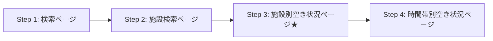

# 調査結果サマリー

## 調査日
2025-12-06

---

## 🔍 発生していた問題

### 1. 日付のズレ
**症状**: ユーザーが12/11を指定しても、12/10の結果が表示される

**原因**:
- 検索フォームには日付入力フィールドがない
- 施設別空き状況ページ（Step 3）で初めて日付を選択できる
- コードではこのページの存在を見落としていた

### 2. 施設選択の失敗
**症状**: 施設を選択しているはずなのに「施設を選んでください」エラーが表示される

**原因**:
```typescript
// ❌ この方法では動作しない
checkbox.checked = true;
checkbox.click();
```
チェックボックスのイベントハンドラーが `.checked` プロパティを強制的に `false` に戻している

### 3. ページ遷移フローの誤認識
**コードの想定**:
```
施設一覧 → 時間帯別空き状況
```

**実際のフロー**:
```
施設一覧 → 施設別空き状況（日付選択） → 時間帯別空き状況
```

中間ページ（Step 3）が抜けていた！

---

## ✅ 解決策

### 1. 正しいページ遷移フロー



**Step 3が重要**: ここで日付を選択する

### 2. 施設選択の正しい方法

```typescript
// ✅ labelをクリックする
const label = document.querySelector(`label[for="${checkbox.id}"]`);
label.click();
```

### 3. 日付選択の実装

```typescript
// 対象日付を YYYYMMDD 形式に変換
const targetDateStr = format(date, 'yyyyMMdd'); // "20251211"

// valueが対象日付で始まるチェックボックスを探す
const checkboxes = document.querySelectorAll('input[name="checkdate"]');
checkboxes.forEach(checkbox => {
  if (checkbox.value.startsWith(targetDateStr)) {
    const label = document.querySelector(`label[for="${checkbox.id}"]`);
    const status = label?.textContent?.trim();

    // ○または△のみ選択
    if (status === '○' || status === '△') {
      label.click();
    }
  }
});
```

---

## 📁 作成されたドキュメント

1. **調査結果まとめ**
   - `docs/investigation/complete-flow-analysis.md`
   - 全ページの詳細なセレクタ情報
   - 動作確認済みのコード例

2. **設計書**
   - `docs/design/scraping-flow-design.md`
   - 正しいフローに基づく設計
   - 各ステップの詳細な実装方法

3. **実装タスク**
   - `docs/tasks/implementation-tasks.md`
   - 優先度付きタスク一覧
   - 具体的な実装コード例

---

## 🔧 必要な修正

### Phase 1: コア機能の修正（必須）

| タスク | 内容 | 優先度 |
|--------|------|--------|
| Task 1.1 | `selectFacilityAndNavigate` の修正 | 🔴 P0 |
| Task 1.2 | 全施設選択メソッドの追加 | 🔴 P0 |
| Task 1.3 | 日付選択メソッドの追加 | 🔴 P0 |
| Task 1.4 | 時間帯別空き状況取得メソッドの追加 | 🔴 P0 |
| Task 1.5 | `scrapeFacilities` の全面改修 | 🔴 P0 |

**見積もり**: 4-6時間

---

## 🎯 主要な変更点

### Before (誤り)

```typescript
async scrapeFacilities(dates: Date[]) {
  // Step 1: 検索ページ → 施設一覧
  await this.navigateToSearchPage(page);
  await this.selectSports(page);
  await this.searchFacilities(page);

  // Step 2: 施設を1つずつ選択 → 空き状況取得
  for (const facility of facilities) {
    await this.selectFacilityAndNavigate(page, facility.id);
    const availability = await this.scrapeAvailability(page, facility, dates);
    // ...
  }
}
```

### After (正しい)

```typescript
async scrapeFacilities(dates: Date[]) {
  // Step 1: 検索ページ → 施設一覧
  await this.navigateToSearchPage(page);
  await this.selectSports(page);
  await this.searchFacilities(page);

  // Step 2: 全施設を選択 → 次へ進む
  await this.selectAllFacilitiesAndNavigate(page);

  // Step 3: 対象日付を選択 → 次へ進む ★追加★
  await this.selectDatesOnFacilityCalendar(page, dates);

  // Step 4: 時間帯別空き状況を取得
  const availability = await this.scrapeTimeSlots(page);
}
```

---

## 📝 重要な発見

### 1. チェックボックス選択のベストプラクティス

```typescript
// ❌ 動作しない
checkbox.checked = true;
checkbox.click();

// ✅ 動作する
const label = document.querySelector(`label[for="${checkbox.id}"]`);
label.click();
```

### 2. 日付valueのフォーマット

```
value="2025121100701   0"
       ^^^^^^^^ ^^^^^ ^^^
       日付     施設  不明
       YYYYMMDD コード
```

### 3. 空き状況のラベル

| ラベル | 意味 | 処理 |
|--------|------|------|
| `○` | 空きあり | 選択する |
| `△` | 一部空き | 選択する |
| `×` | 空きなし | 選択しない |
| `－` | 対象外 | 選択しない |
| `休` | 休館日 | 選択できない |

### 4. 制約事項

- 最大10日まで選択可能（システム制約）
- 施設は全選択が前提（個別選択は今後の改善案）

---

## 🧪 検証済み動作

### 成功例

```
✅ Step 1: 検索ページへアクセス
✅ Step 2a: 屋内スポーツを選択
✅ Step 2b: バスケットボールを選択
✅ Step 2c: 検索ボタンをクリック
→ 施設検索ページへ遷移

✅ Step 3a: すべての施設を選択
  総数: 10
  選択済み: 10

✅ Step 3b: 「次へ進む」ボタンをクリック
→ 施設別空き状況ページへ遷移
  URL: https://www.11489.jp/Umi/web/Yoyaku/WgR_ShisetsubetsuAkiJoukyou
  カレンダー数: 10（各施設ごと）

✅ 日付データの取得に成功
  例: "2025121100701   0" → 2025年12月11日
```

---

## 📊 取得できるデータ

### 施設一覧（バスケットボール用）

```json
[
  { "id": "341007", "name": "宇美勤労者体育センター" },
  { "id": "341009", "name": "宇美南町民センター" },
  { "id": "341014", "name": "宇美町立宇美中学校" },
  { "id": "341015", "name": "宇美町立宇美東中学校" },
  { "id": "341016", "name": "宇美町立宇美南中学校" },
  { "id": "341017", "name": "宇美町立宇美小学校" },
  { "id": "341018", "name": "宇美町立宇美東小学校" },
  { "id": "341019", "name": "宇美町立原田小学校" },
  { "id": "341020", "name": "宇美町立桜原小学校" },
  { "id": "341021", "name": "宇美町立井野小学校" }
]
```

### 日付別空き状況

```json
{
  "facilityName": "宇美勤労者体育センター",
  "courts": [
    {
      "name": "体育館　全面",
      "timeSlots": [
        { "time": "8:30-9:00", "available": true, "status": "○" },
        { "time": "9:00-9:30", "available": false, "status": "×" },
        { "time": "9:30-10:00", "available": true, "status": "○" }
      ]
    }
  ]
}
```

---

## 🔗 関連ファイル

### 調査用スクリプト

- `scripts/investigate-search-form-date.ts` - 検索フォームの日付フィールド調査
- `scripts/investigate-date-page.ts` - 日付選択ページの調査
- `scripts/investigate-step3-date-calendar.ts` - 施設別空き状況ページの調査
- `scripts/investigate-real-flow.ts` - 手動操作用の調査スクリプト

### 保存されたHTMLファイル

- `search-form-initial.html` - 検索フォームの初期状態
- `date-selection-page.html` - 施設一覧ページ（エラー時）
- `step3-facility-date-calendar.html` - 施設別空き状況ページ（成功）

---

## 🚀 次のステップ

1. **Phase 1タスクの実装**（優先度: 🔴 P0）
   - [ ] Task 1.1: `selectFacilityAndNavigate` の修正
   - [ ] Task 1.2: 全施設選択メソッドの追加
   - [ ] Task 1.3: 日付選択メソッドの追加
   - [ ] Task 1.4: 時間帯別空き状況取得メソッドの追加
   - [ ] Task 1.5: `scrapeFacilities` の全面改修

2. **統合テスト**
   - [ ] 1日の空き状況取得テスト
   - [ ] 複数日の空き状況取得テスト
   - [ ] エラーケースのテスト

3. **ドキュメント更新**
   - [ ] APIドキュメントの更新
   - [ ] README の更新

---

## 📚 参考資料

- [完全なフロー調査結果](./investigation/complete-flow-analysis.md)
- [スクレイピングフロー設計書](./design/scraping-flow-design.md)
- [実装タスク一覧](./tasks/implementation-tasks.md)
- [手動操作レポート](./manual_execution/report.md)

---

**作成者**: Claude (AI Assistant)
**作成日**: 2025-12-06
**ステータス**: ✅ 完了
