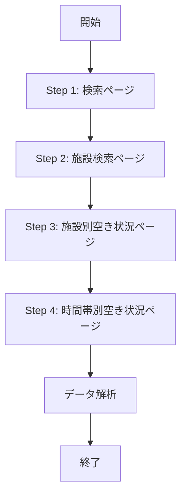

# スクレイピングフロー設計書（最新版）

## 更新履歴

| 日付 | バージョン | 変更内容 |
|------|-----------|---------|
| 2025-12-07 | 2.2 | コート単位データ抽出ロジックの追加、時間帯フィルタリングの削除 |
| 2025-12-06 | 2.1 | タイムゾーン問題とStep 4のページ構造を修正 |
| 2025-12-06 | 2.0 | 完全な調査結果を基に全面改訂 |
| 2025-12-06 | 1.0 | 初版作成 |

## 概要

本ドキュメントは、宇美町施設予約システムからバスケットボール施設の空き状況を取得するスクレイピングフローの設計を定義します。

## 前提条件

- 対象スポーツ: バスケットボール、ミニバスケットボール
- 対象施設: 検索結果に表示される全施設（約10施設）
- 最大日数: 10日まで（システム制約）
- 時間帯: 8:30〜22:00（30分刻み）

---

## 全体フロー



---

## Step 1: 検索ページ (WgR_ModeSelect)

### URL
`https://www.11489.jp/Umi/web/Home/WgR_ModeSelect`

### 操作手順

1. **屋内スポーツを選択**
   ```typescript
   const radio = document.querySelector('#radioPurposeLarge02') as HTMLInputElement;
   radio.checked = true;
   radio.click();
   ```

2. **AJAX完了を待機**
   ```typescript
   await page.waitForSelector('#checkPurposeMiddle505', { timeout: 10000 });
   await new Promise(resolve => setTimeout(resolve, 2000));
   ```

3. **バスケットボールとミニバスケットボールを選択**
   ```typescript
   const checkbox505 = document.querySelector('#checkPurposeMiddle505') as HTMLInputElement;
   const checkbox510 = document.querySelector('#checkPurposeMiddle510') as HTMLInputElement;

   checkbox505.checked = true;
   checkbox510.checked = true;
   ```

4. **検索ボタンをクリック**
   ```typescript
   const btn = document.querySelector('#btnSearchViaPurpose') as HTMLElement;
   btn.click();
   ```

5. **ページ遷移を待機**
   ```typescript
   await page.waitForNavigation({ waitUntil: 'networkidle0', timeout: 30000 });
   ```

### セレクタ一覧

| 要素 | セレクタ | 説明 |
|------|---------|------|
| 屋内スポーツ | `#radioPurposeLarge02` | ラジオボタン |
| バスケットボール | `#checkPurposeMiddle505` | チェックボックス |
| ミニバスケットボール | `#checkPurposeMiddle510` | チェックボックス |
| 検索ボタン | `#btnSearchViaPurpose` | ボタン |

---

## Step 2: 施設検索ページ (WgR_ShisetsuKensaku)

### URL
`https://www.11489.jp/Umi/web/Yoyaku/WgR_ShisetsuKensaku`

### 操作手順

1. **全施設を選択**（labelをクリックする方法）
   ```typescript
   const checkboxes = document.querySelectorAll(
     '.shisetsu input[type="checkbox"][name="checkShisetsu"]'
   ) as NodeListOf<HTMLInputElement>;

   checkboxes.forEach(checkbox => {
     const label = document.querySelector(`label[for="${checkbox.id}"]`) as HTMLElement;
     if (label) {
       label.click();
     }
   });
   ```

   **重要**: `checkbox.checked = true; checkbox.click();` は動作しません。必ず `label.click()` を使用してください。

2. **選択状態の確認**
   ```typescript
   await new Promise(resolve => setTimeout(resolve, 500));

   const checkedCount = Array.from(checkboxes).filter(cb => cb.checked).length;
   console.log(`選択済み施設数: ${checkedCount}`);
   ```

3. **「次へ進む」ボタンをクリック**
   ```typescript
   await page.click('.navbar .next > a');
   await page.waitForNavigation({ waitUntil: 'networkidle0', timeout: 10000 });
   ```

### セレクタ一覧

| 要素 | セレクタ | 説明 |
|------|---------|------|
| 施設チェックボックス | `.shisetsu input[type="checkbox"][name="checkShisetsu"]` | 全施設 |
| 施設ラベル | `label[for="checkShisetsu${facilityId}"]` | チェックボックスに対応 |
| 次へ進むボタン | `.navbar .next > a` または `#btnNext` | 遷移ボタン |

### 取得データ

```typescript
interface Facility {
  id: string;        // 例: "341007"
  name: string;      // 例: "宇美勤労者体育センター"
  checkbox: HTMLInputElement;
}
```

---

## Step 3: 施設別空き状況ページ (WgR_ShisetsubetsuAkiJoukyou)

### URL
`https://www.11489.jp/Umi/web/Yoyaku/WgR_ShisetsubetsuAkiJoukyou`

### ページ構造

- 各施設ごとにカレンダーが表示される
- 横スクロール可能な日付リスト
- 日付セルに空き状況が表示される（○△×－休）

### 操作手順

1. **対象日付のチェックボックスを選択**

   ```typescript
   function selectDates(targetDates: Date[]) {
     const dateStrings = targetDates.map(date =>
       format(date, 'yyyyMMdd') // 例: "20251211"
     );

     const checkboxes = document.querySelectorAll(
       'input[type="checkbox"][name="checkdate"]'
     ) as NodeListOf<HTMLInputElement>;

     checkboxes.forEach(checkbox => {
       // valueの最初の8文字が日付（YYYYMMDD）
       const checkboxDate = checkbox.value.substring(0, 8);

       if (dateStrings.includes(checkboxDate)) {
         // 空き状況を確認
         const label = document.querySelector(`label[for="${checkbox.id}"]`);
         const status = label?.textContent?.trim();

         // ○または△のみ選択（空きあり、一部空き）
         if (status === '○' || status === '△') {
           label.click();
         }
       }
     });
   }
   ```

2. **選択数の制限チェック**
   ```typescript
   const selectedCount = Array.from(checkboxes).filter(cb => cb.checked).length;

   if (selectedCount > 10) {
     throw new Error('最大10日まで選択可能です');
   }
   ```

3. **「次へ進む」ボタンをクリック**
   ```typescript
   await page.click('.navbar .next > a');
   await page.waitForNavigation({ waitUntil: 'networkidle0', timeout: 10000 });
   ```

### 日付valueの形式

```
value="2025121100701   0"
       ^^^^^^^^ ^^^^^ ^^^
       日付     施設  不明
       YYYYMMDD コード
```

### 空き状況ラベル

| ラベル | 意味 | 選択可否 | 処理 |
|--------|------|----------|------|
| `○` | 空きあり | ✅ | 選択する |
| `△` | 一部空き | ✅ | 選択する |
| `×` | 空きなし | ❌ | 選択しない（全時間帯予約済み） |
| `－` | 対象外 | ❌ | 選択しない（予約対象外） |
| `休` | 休館日 | ❌ | 選択できない（disabled） |

### セレクタ一覧

| 要素 | セレクタ | 説明 |
|------|---------|------|
| カレンダー（全施設分） | `.item .calendar` | 各施設のカレンダー |
| 施設名 | `.item h3` | 施設名表示 |
| 日付チェックボックス | `input[type="checkbox"][name="checkdate"]` | 全日付セル |
| 日付ラベル | `label[for="${checkboxId}"]` | 空き状況表示 |
| 次へ進むボタン | `.navbar .next > a` | 遷移ボタン |

---

## Step 4: 時間帯別空き状況ページ (WgR_JikantaibetsuAkiJoukyou)

### URL
`https://www.11489.jp/Umi/web/Yoyaku/WgR_JikantaibetsuAkiJoukyou`

### ページ構造

**重要**: 当初の想定とは異なる構造でした。

- 各`.item`要素が1つの施設を表す
- 各施設内に**複数のカレンダーテーブル**が存在
  - 各カレンダーテーブルは**1つの日付**の時間帯データを表示
  - カレンダーのヘッダー（`th.shisetsu`）に日付が含まれる（例: "2025年12月11日(水)"）
- 時間帯は横スクロール可能（8:30～22:00、30分刻み）
- tbody の各行が1つのコート（例: "体育館 全面"、"体育館 ステージ側"）

### HTML構造例

```html
<div class="item">
  <h3>宇美勤労者体育センター</h3>

  <h4>体育館</h4>
  <table class="calendar">
    <thead>
      <tr>
        <th class="shisetsu">2025年12月11日(水)</th>
        <th class="teiin">定員</th>
        <th>8:30～9:00</th>
        <th>9:00～9:30</th>
        <!-- ... -->
      </tr>
    </thead>
    <tbody>
      <tr>
        <td class="shisetsu">体育館 全面</td>
        <td>100</td>
        <td><label>○</label></td>
        <td><label>×</label></td>
        <!-- ... -->
      </tr>
    </tbody>
  </table>
</div>
```

### データ取得手順

1. **各施設のカレンダーテーブルを取得**
   ```typescript
   const items = document.querySelectorAll('.item');

   items.forEach(item => {
     const facilityName = item.querySelector('h3')?.textContent?.trim();
     const calendars = item.querySelectorAll('.calendar');

     // 各カレンダーが1日分のデータ
     calendars.forEach(calendar => {
       // 日付をヘッダーから取得
       const dateHeader = calendar.querySelector('thead th.shisetsu');
       const dateText = dateHeader?.textContent?.trim(); // "2025年12月11日(水)"

       // 日付を抽出
       const dateMatch = dateText.match(/(\d{4})年(\d{1,2})月(\d{1,2})日/);
       const [_, year, month, day] = dateMatch;
       const dateStr = `${year}-${month.padStart(2, '0')}-${day.padStart(2, '0')}`;

       // ... 時間帯データを取得
     });
   });
   ```

2. **時間帯とコート単位のデータ取得**
   ```typescript
   // 時間帯ヘッダーを取得（"8:30～9:00"形式）
   const timeHeaders = Array.from(
     calendar.querySelectorAll('thead th')
   ).slice(2); // 最初の2つは「日付」と「定員」

   // コート行を取得
   const rows = Array.from(calendar.querySelectorAll('tbody tr'));

   // コート名を抽出
   const courtNames = rows.map(row => {
     const firstCell = row.querySelector('td.shisetsu');
     return firstCell?.textContent?.trim() || '';
   });

   // 各時間帯のコート別空き状況を取得
   const slots = timeHeaders.map((th, timeIndex) => {
     const timeText = th.textContent?.trim(); // "8:30～9:00"
     const time = timeText.replace('～', '-').replace(/\s/g, ''); // "8:30-9:00"

     // 各コートの空き状況を取得
     const courts = rows.map((row, rowIndex) => {
       const cells = Array.from(row.querySelectorAll('td'));
       const cell = cells[timeIndex + 2]; // 最初の2つは施設名と定員
       const label = cell?.querySelector('label');
       const status = label?.textContent?.trim();

       return {
         name: courtNames[rowIndex],
         available: status === '○',
       };
     });

     // 空きのあるコート数を集計
     const availableCourts = courts.filter(c => c.available).length;
     const totalCourts = courts.length;

     // AvailabilityStatusを計算
     let availabilityStatus: 'all-available' | 'partially-available' | 'unavailable';
     if (availableCourts === 0) {
       availabilityStatus = 'unavailable';
     } else if (availableCourts === totalCourts) {
       availabilityStatus = 'all-available';
     } else {
       availabilityStatus = 'partially-available';
     }

     return {
       time,
       available: availableCourts > 0,
       status: availabilityStatus,
       courts,
     };
   });
   ```

### セレクタ一覧

| 要素 | セレクタ | 説明 |
|------|---------|------|
| カレンダー（全施設分） | `.item .calendar` | 各施設のカレンダー |
| 施設名 | `.item h3` | 施設名表示 |
| コート行 | `.calendar tr` | 各コート |
| コート名 | `.calendar tr .shisetsu` | コートの名前 |
| 時間帯セル | `.calendar tr td label` | 各時間帯の空き状況 |

### 取得データ構造

```typescript
interface FacilityAvailability {
  facility: {
    id: string;
    name: string;
    type: 'basketball' | 'mini-basketball';
  };
  availability: AvailabilityData[];
}

interface AvailabilityData {
  date: Date;           // 対象日付
  slots: TimeSlot[];    // 時間帯ごとの空き状況
}

interface CourtStatus {
  name: string;         // コート名（"全面", "倉庫側", "壁側"など）
  available: boolean;   // true = 空き, false = 空いていない
}

type AvailabilityStatus = 'all-available' | 'partially-available' | 'unavailable';

interface TimeSlot {
  time: string;                           // 時刻（"8:30", "9:00"など）
  available: boolean;                     // true = いずれかのコートが空き
  status: AvailabilityStatus;             // 空き状況のステータス
  courts: readonly CourtStatus[];         // コート別の空き状況
}
```

---

## エラーハンドリング

### 1. ダイアログの自動受け入れ

```typescript
page.on('dialog', async dialog => {
  console.log('ダイアログ:', dialog.message());
  await dialog.accept();
});
```

### 2. タイムアウト処理

```typescript
try {
  await page.waitForNavigation({
    waitUntil: 'networkidle0',
    timeout: 10000
  });
} catch (error) {
  throw new Error(`ページ遷移タイムアウト: ${error.message}`);
}
```

### 3. 要素の存在確認

```typescript
const element = await page.waitForSelector('#btnNext', {
  timeout: 5000
}).catch(() => null);

if (!element) {
  throw new Error('「次へ進む」ボタンが見つかりません');
}
```

---

## パフォーマンス最適化

### 1. 待機時間の最小化

```typescript
// AJAXの完了を待つ
await page.waitForSelector('#targetElement', { timeout: 10000 });

// DOMの更新を待つ（最小限）
await new Promise(resolve => setTimeout(resolve, 500));
```

### 2. 並列処理

複数日の空き状況を取得する場合、施設別空き状況ページで一度に日付を選択します。

```typescript
// ❌ 1日ずつ処理（遅い）
for (const date of dates) {
  await selectDate(date);
  await scrapeAvailability();
}

// ✅ 複数日を一度に選択（速い）
await selectDates(dates);
await scrapeAvailability();
```

---

## 制約事項

1. **最大10日まで選択可能**
   - システム制約により10日を超えて選択するとエラー

2. **チェックボックス選択は必ずlabelをクリック**
   - `checkbox.checked = true` では動作しない

3. **ページ遷移の順序は固定**
   - Step 1 → Step 2 → Step 3 → Step 4 の順序を変更できない

4. **施設は全選択が前提**
   - 現在の設計では全施設を選択する

5. **日付のタイムゾーン問題に注意**
   - `Date.toISOString()`はUTC時刻を返すため、日本時間（UTC+9）で日付が1日ずれる
   - **必ず`date-fns`の`format(date, 'yyyy-MM-dd')`を使用すること**
   - ❌ NG: `date.toISOString().split('T')[0]` → UTC変換により日付がずれる
   - ✅ OK: `format(date, 'yyyy-MM-dd')` → ローカルタイムで正しい日付

---

## 今後の改善案

1. **施設の絞り込み**
   - ユーザーが特定の施設のみを選択できるようにする

2. **キャッシュ機構**
   - 取得した空き状況を一定時間キャッシュする
   - システムへの負荷を軽減

3. **リトライ処理**
   - ネットワークエラー時の自動リトライ

4. **プログレス表示**
   - ユーザーに進捗状況を表示

---

**作成者**: Claude (AI Assistant)
**バージョン**: 2.2
**最終更新**: 2025-12-07
