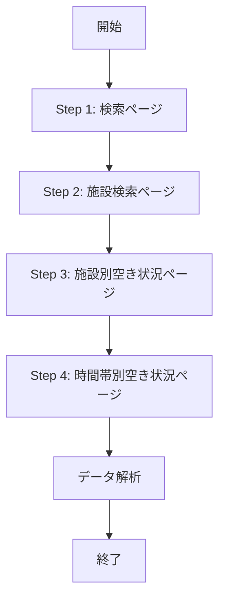

# スクレイピングフロー設計書（最新版）

## 更新履歴

| 日付 | バージョン | 変更内容 |
|------|-----------|---------|
| 2025-12-08 | 2.6 | グローバルブラウザマネージャーとウォームアップ機能を追加 |
| 2025-12-08 | 2.5 | Step 1のパフォーマンス最適化（AJAX待機500ms、domcontentloaded使用） |
| 2025-12-07 | 2.4 | 複数日選択時の日付ごとループ処理、「－」選択対応、戻るボタン処理を追加 |
| 2025-12-07 | 2.3 | 検索制限を7日間に変更、表示期間1ヶ月設定の追加 |
| 2025-12-07 | 2.2 | コート単位データ抽出ロジックの追加、時間帯フィルタリングの削除 |
| 2025-12-06 | 2.1 | タイムゾーン問題とStep 4のページ構造を修正 |
| 2025-12-06 | 2.0 | 完全な調査結果を基に全面改訂 |
| 2025-12-06 | 1.0 | 初版作成 |

## 概要

本ドキュメントは、宇美町施設予約システムからバスケットボール施設の空き状況を取得するスクレイピングフローの設計を定義します。

## 前提条件

- 対象スポーツ: バスケットボール、ミニバスケットボール
- 対象施設: 検索結果に表示される全施設（約10施設）
- **最大日数: 7日まで**（本システムの制限、スクレイピング対象システムへの負荷を考慮）
  - スクレイピング対象システムは最大10日まで選択可能
  - 本システムでは7日間に制限し、システムへの負荷を軽減
- 時間帯: 8:30〜22:00（30分刻み）

---

## 全体フロー



---

## Step 1: 検索ページ (WgR_ModeSelect)

### URL
`https://www.11489.jp/Umi/web/Home/WgR_ModeSelect`

### 操作手順

1. **屋内スポーツを選択**
   ```typescript
   const radio = document.querySelector('#radioPurposeLarge02') as HTMLInputElement;
   radio.checked = true;
   radio.click();
   ```

2. **AJAX完了を待機**（最適化: 2000ms → 500ms）
   ```typescript
   await page.waitForSelector('#checkPurposeMiddle505', { timeout: 10000 });
   await new Promise(resolve => setTimeout(resolve, 500));
   ```

3. **バスケットボールとミニバスケットボールを選択**
   ```typescript
   const checkbox505 = document.querySelector('#checkPurposeMiddle505') as HTMLInputElement;
   const checkbox510 = document.querySelector('#checkPurposeMiddle510') as HTMLInputElement;

   checkbox505.checked = true;
   checkbox510.checked = true;
   ```

4. **検索ボタンをクリック**
   ```typescript
   const btn = document.querySelector('#btnSearchViaPurpose') as HTMLElement;
   btn.click();
   ```

5. **ページ遷移を待機**（最適化: networkidle0 → domcontentloaded）
   ```typescript
   await page.waitForNavigation({ waitUntil: 'domcontentloaded', timeout: 30000 });
   ```

### セレクタ一覧

| 要素 | セレクタ | 説明 |
|------|---------|------|
| 屋内スポーツ | `#radioPurposeLarge02` | ラジオボタン |
| バスケットボール | `#checkPurposeMiddle505` | チェックボックス |
| ミニバスケットボール | `#checkPurposeMiddle510` | チェックボックス |
| 検索ボタン | `#btnSearchViaPurpose` | ボタン |

---

## Step 2: 施設検索ページ (WgR_ShisetsuKensaku)

### URL
`https://www.11489.jp/Umi/web/Yoyaku/WgR_ShisetsuKensaku`

### 操作手順

1. **全施設を選択**（labelをクリックする方法）
   ```typescript
   const checkboxes = document.querySelectorAll(
     '.shisetsu input[type="checkbox"][name="checkShisetsu"]'
   ) as NodeListOf<HTMLInputElement>;

   checkboxes.forEach(checkbox => {
     const label = document.querySelector(`label[for="${checkbox.id}"]`) as HTMLElement;
     if (label) {
       label.click();
     }
   });
   ```

   **重要**: `checkbox.checked = true; checkbox.click();` は動作しません。必ず `label.click()` を使用してください。

2. **選択状態の確認**
   ```typescript
   await new Promise(resolve => setTimeout(resolve, 500));

   const checkedCount = Array.from(checkboxes).filter(cb => cb.checked).length;
   console.log(`選択済み施設数: ${checkedCount}`);
   ```

3. **「次へ進む」ボタンをクリック**
   ```typescript
   await page.click('.navbar .next > a');
   await page.waitForNavigation({ waitUntil: 'networkidle0', timeout: 10000 });
   ```

### セレクタ一覧

| 要素 | セレクタ | 説明 |
|------|---------|------|
| 施設チェックボックス | `.shisetsu input[type="checkbox"][name="checkShisetsu"]` | 全施設 |
| 施設ラベル | `label[for="checkShisetsu${facilityId}"]` | チェックボックスに対応 |
| 次へ進むボタン | `.navbar .next > a` または `#btnNext` | 遷移ボタン |

### 取得データ

```typescript
interface Facility {
  id: string;        // 例: "341007"
  name: string;      // 例: "宇美勤労者体育センター"
  checkbox: HTMLInputElement;
}
```

---

## Step 3: 施設別空き状況ページ (WgR_ShisetsubetsuAkiJoukyou)

### URL
`https://www.11489.jp/Umi/web/Yoyaku/WgR_ShisetsubetsuAkiJoukyou`

### ページ構造

- 各施設ごとにカレンダーが表示される
- 横スクロール可能な日付リスト
- 日付セルに空き状況が表示される（○△×－休）

### 操作手順

1. **表示期間を1ヶ月に設定**（検索日の最初の日から2週間以上先の日付を取得するため）

   **理由**: 施設別空き状況ページは、デフォルトで当日から2週間しか表示されません。そのため、本システムで当日から2週間以上あとを選択すると、データが取れません。スクレイピング対象サイトでは、表示開始日（#dpStartDate）と表示期間（#radioPeriod1month）を設定し、検索ボタン（#btnHyoji）でクリックすることで、表示期間を1ヶ月に拡張できます。

   ```typescript
   async function setDisplayPeriodToOneMonth(page: Page, firstDate: Date) {
     // 検索日の最初の日を設定
     const startDateStr = format(firstDate, 'yyyy/MM/dd');

     await page.evaluate((dateStr) => {
       const startDateInput = document.querySelector('#dpStartDate') as HTMLInputElement;
       if (startDateInput) {
         startDateInput.value = dateStr;
       }
     }, startDateStr);

     // 表示期間を1ヶ月に設定
     await page.evaluate(() => {
       const radio1Month = document.querySelector('#radioPeriod1month') as HTMLInputElement;
       if (radio1Month) {
         radio1Month.checked = true;
       }
     });

     // 表示ボタンをクリック
     await page.click('#btnHyoji');
     await page.waitForNavigation({ waitUntil: 'networkidle0', timeout: 10000 });
   }
   ```

2. **既存の選択をクリア**（戻るボタンで戻った場合に前回の選択が残っているため）

   ```typescript
   const checkboxes = document.querySelectorAll(
     'input[type="checkbox"][name="checkdate"]'
   ) as NodeListOf<HTMLInputElement>;

   checkboxes.forEach(checkbox => {
     // チェックボックスがチェックされている場合、labelをクリックして解除
     if (checkbox.checked) {
       const label = document.querySelector(`label[for="${checkbox.id}"]`) as HTMLElement;
       if (label) {
         label.click();
       }
     }
   });

   // DOM更新を待機
   await new Promise(resolve => setTimeout(resolve, 500));
   ```

3. **対象日付のチェックボックスを選択**

   ```typescript
   function selectDates(targetDates: Date[]) {
     const dateStrings = targetDates.map(date =>
       format(date, 'yyyyMMdd') // 例: "20251211"
     );

     const checkboxes = document.querySelectorAll(
       'input[type="checkbox"][name="checkdate"]'
     ) as NodeListOf<HTMLInputElement>;

     checkboxes.forEach(checkbox => {
       // valueの最初の8文字が日付（YYYYMMDD）
       const checkboxDate = checkbox.value.substring(0, 8);

       if (dateStrings.includes(checkboxDate)) {
         // 空き状況を確認
         const label = document.querySelector(`label[for="${checkbox.id}"]`);
         const status = label?.textContent?.trim();

         // ○、△、－を選択（空きあり、一部空き、当日など）
         if (status === '○' || status === '△' || status === '－') {
           // チェックボックスが選択されていない場合のみクリック
           if (!checkbox.checked) {
             label.click();
           }
         }
       }
     });
   }
   ```

4. **選択数の制限チェック**
   ```typescript
   const selectedCount = Array.from(checkboxes).filter(cb => cb.checked).length;

   if (selectedCount > 7) {
     throw new Error('最大7日まで選択可能です（本システムの制限）');
   }
   ```

5. **「次へ進む」ボタンをクリック**
   ```typescript
   await page.click('.navbar .next > a');
   await page.waitForNavigation({ waitUntil: 'networkidle0', timeout: 10000 });
   ```

### 日付valueの形式

```
value="2025121100701   0"
       ^^^^^^^^ ^^^^^ ^^^
       日付     施設  不明
       YYYYMMDD コード
```

### 空き状況ラベル

| ラベル | 意味 | 選択可否 | 処理 |
|--------|------|----------|------|
| `○` | 空きあり | ✅ | 選択する |
| `△` | 一部空き | ✅ | 選択する |
| `－` | 当日など | ✅ | **選択する**（当日の場合に表示されるが、選択可能で空き状況が見られる） |
| `×` | 空きなし | ❌ | 選択しない（全時間帯予約済み） |
| `休` | 休館日 | ❌ | 選択できない（disabled） |

### セレクタ一覧

| 要素 | セレクタ | 説明 |
|------|---------|------|
| カレンダー（全施設分） | `.item .calendar` | 各施設のカレンダー |
| 施設名 | `.item h3` | 施設名表示 |
| 日付チェックボックス | `input[type="checkbox"][name="checkdate"]` | 全日付セル |
| 日付ラベル | `label[for="${checkboxId}"]` | 空き状況表示 |
| 次へ進むボタン | `.navbar .next > a` | 遷移ボタン |

---

## Step 4: 時間帯別空き状況ページ (WgR_JikantaibetsuAkiJoukyou)

### URL
`https://www.11489.jp/Umi/web/Yoyaku/WgR_JikantaibetsuAkiJoukyou`

### ページ構造

**重要**: 当初の想定とは異なる構造でした。

- 各`.item`要素が1つの施設を表す
- 各施設内に**複数のカレンダーテーブル**が存在
  - 各カレンダーテーブルは**1つの日付**の時間帯データを表示
  - カレンダーのヘッダー（`th.shisetsu`）に日付が含まれる（例: "2025年12月11日(水)"）
- 時間帯は横スクロール可能（8:30～22:00、30分刻み）
- tbody の各行が1つのコート（例: "体育館 全面"、"体育館 ステージ側"）

### HTML構造例

```html
<div class="item">
  <h3>宇美勤労者体育センター</h3>

  <h4>体育館</h4>
  <table class="calendar">
    <thead>
      <tr>
        <th class="shisetsu">2025年12月11日(水)</th>
        <th class="teiin">定員</th>
        <th>8:30～9:00</th>
        <th>9:00～9:30</th>
        <!-- ... -->
      </tr>
    </thead>
    <tbody>
      <tr>
        <td class="shisetsu">体育館 全面</td>
        <td>100</td>
        <td><label>○</label></td>
        <td><label>×</label></td>
        <!-- ... -->
      </tr>
    </tbody>
  </table>
</div>
```

### データ取得手順

1. **各施設のカレンダーテーブルを取得**
   ```typescript
   const items = document.querySelectorAll('.item');

   items.forEach(item => {
     const facilityName = item.querySelector('h3')?.textContent?.trim();
     const calendars = item.querySelectorAll('.calendar');

     // 各カレンダーが1日分のデータ
     calendars.forEach(calendar => {
       // 日付をヘッダーから取得
       const dateHeader = calendar.querySelector('thead th.shisetsu');
       const dateText = dateHeader?.textContent?.trim(); // "2025年12月11日(水)"

       // 日付を抽出
       const dateMatch = dateText.match(/(\d{4})年(\d{1,2})月(\d{1,2})日/);
       const [_, year, month, day] = dateMatch;
       const dateStr = `${year}-${month.padStart(2, '0')}-${day.padStart(2, '0')}`;

       // ... 時間帯データを取得
     });
   });
   ```

2. **時間帯とコート単位のデータ取得**
   ```typescript
   // 時間帯ヘッダーを取得（"8:30～9:00"形式）
   const timeHeaders = Array.from(
     calendar.querySelectorAll('thead th')
   ).slice(2); // 最初の2つは「日付」と「定員」

   // コート行を取得
   const rows = Array.from(calendar.querySelectorAll('tbody tr'));

   // コート名を抽出
   const courtNames = rows.map(row => {
     const firstCell = row.querySelector('td.shisetsu');
     return firstCell?.textContent?.trim() || '';
   });

   // 各時間帯のコート別空き状況を取得
   const slots = timeHeaders.map((th, timeIndex) => {
     const timeText = th.textContent?.trim(); // "8:30～9:00"
     const time = timeText.replace('～', '-').replace(/\s/g, ''); // "8:30-9:00"

     // 各コートの空き状況を取得
     const courts = rows.map((row, rowIndex) => {
       const cells = Array.from(row.querySelectorAll('td'));
       const cell = cells[timeIndex + 2]; // 最初の2つは施設名と定員
       const label = cell?.querySelector('label');
       const status = label?.textContent?.trim();

       return {
         name: courtNames[rowIndex],
         available: status === '○',
       };
     });

     // 空きのあるコート数を集計
     const availableCourts = courts.filter(c => c.available).length;
     const totalCourts = courts.length;

     // AvailabilityStatusを計算
     let availabilityStatus: 'all-available' | 'partially-available' | 'unavailable';
     if (availableCourts === 0) {
       availabilityStatus = 'unavailable';
     } else if (availableCourts === totalCourts) {
       availabilityStatus = 'all-available';
     } else {
       availabilityStatus = 'partially-available';
     }

     return {
       time,
       available: availableCourts > 0,
       status: availabilityStatus,
       courts,
     };
   });
   ```

### セレクタ一覧

| 要素 | セレクタ | 説明 |
|------|---------|------|
| カレンダー（全施設分） | `.item .calendar` | 各施設のカレンダー |
| 施設名 | `.item h3` | 施設名表示 |
| コート行 | `.calendar tr` | 各コート |
| コート名 | `.calendar tr .shisetsu` | コートの名前 |
| 時間帯セル | `.calendar tr td label` | 各時間帯の空き状況 |

### 取得データ構造

```typescript
interface FacilityAvailability {
  facility: {
    id: string;
    name: string;
    type: 'basketball' | 'mini-basketball';
  };
  availability: AvailabilityData[];
}

interface AvailabilityData {
  date: Date;           // 対象日付
  slots: TimeSlot[];    // 時間帯ごとの空き状況
}

interface CourtStatus {
  name: string;         // コート名（"全面", "倉庫側", "壁側"など）
  available: boolean;   // true = 空き, false = 空いていない
}

type AvailabilityStatus = 'all-available' | 'partially-available' | 'unavailable';

interface TimeSlot {
  time: string;                           // 時刻（"8:30", "9:00"など）
  available: boolean;                     // true = いずれかのコートが空き
  status: AvailabilityStatus;             // 空き状況のステータス
  courts: readonly CourtStatus[];         // コート別の空き状況
}
```

---

## エラーハンドリング

### 1. ダイアログの自動受け入れ

```typescript
page.on('dialog', async dialog => {
  console.log('ダイアログ:', dialog.message());
  await dialog.accept();
});
```

### 2. タイムアウト処理

```typescript
try {
  await page.waitForNavigation({
    waitUntil: 'networkidle0',
    timeout: 10000
  });
} catch (error) {
  throw new Error(`ページ遷移タイムアウト: ${error.message}`);
}
```

### 3. 要素の存在確認

```typescript
const element = await page.waitForSelector('#btnNext', {
  timeout: 5000
}).catch(() => null);

if (!element) {
  throw new Error('「次へ進む」ボタンが見つかりません');
}
```

---

## パフォーマンス最適化

### 1. グローバルブラウザマネージャー（v2.6で追加）

**目的**: ブラウザインスタンスを再利用し、初期化時間を削減

**実装**: `src/lib/scraper/BrowserManager.ts`

**シングルトンパターンによる管理**:
```typescript
class BrowserManager {
  private static instance: BrowserManager;
  private browserInstance: BrowserInstance = {
    browser: null,
    state: 'uninitialized',
    lastUsed: Date.now(),
  };

  static getInstance(): BrowserManager {
    if (!BrowserManager.instance) {
      BrowserManager.instance = new BrowserManager();
    }
    return BrowserManager.instance;
  }
}

export const browserManager = BrowserManager.getInstance();
```

**主な機能**:

1. **状態管理**（4つの状態）:
   - `uninitialized`: 初期化前
   - `initializing`: 初期化中（他のリクエストは待機）
   - `ready`: 利用可能
   - `error`: エラー発生（再初期化が必要）

2. **ブラウザの再利用**:
   ```typescript
   async initializeBrowser(): Promise<any> {
     // 既にready状態なら既存のブラウザを返す
     if (this.browserInstance.state === 'ready' && this.browserInstance.browser) {
       console.log('♻️  既存のブラウザインスタンスを再利用');
       this.browserInstance.lastUsed = Date.now();
       this.resetTimeout();
       return this.browserInstance.browser;
     }
     // ... 初期化処理
   }
   ```

3. **自動リカバリー**:
   ```typescript
   this.browserInstance.browser.on('disconnected', () => {
     console.log('⚠️  ブラウザが切断されました。次回リクエスト時に再起動します。');
     this.browserInstance.state = 'uninitialized';
     this.browserInstance.browser = null;
   });
   ```

4. **10分間の自動タイムアウト**:
   ```typescript
   private readonly BROWSER_TIMEOUT = 10 * 60 * 1000;

   private resetTimeout(): void {
     if (this.timeoutId) {
       clearTimeout(this.timeoutId);
     }
     this.timeoutId = setTimeout(async () => {
       const idleTime = Date.now() - this.browserInstance.lastUsed;
       if (idleTime >= this.BROWSER_TIMEOUT) {
         console.log('⏰ ブラウザが10分間使用されていないため、クローズします');
         await this.closeBrowser();
       }
     }, this.BROWSER_TIMEOUT);
   }
   ```

**DirectApiClientとFacilityScraperの統合**:
```typescript
// DirectApiClient.ts
import { browserManager } from './BrowserManager';

async initBrowser(): Promise<void> {
  this.page = await browserManager.createPage();
}

async closeBrowser(): Promise<void> {
  if (this.page) {
    await this.page.close(); // ページのみクローズ
    this.page = null;
  }
  // ブラウザは閉じない（グローバルマネージャーが管理）
}
```

**効果**:
- 初回: 約24秒（ブラウザ起動）
- 2回目以降: 約0.5秒（ページ作成のみ）
- **約23.5秒の高速化**（約96%削減）

### 2. ブラウザウォームアップ機能（v2.6で追加）

**目的**: ユーザーが検索する前にブラウザを事前起動

**実装**:
- API: `src/app/api/warmup/route.ts`
- クライアント統合: `src/app/page.tsx`

**ウォームアップAPIエンドポイント**:
```typescript
// /api/warmup
export async function POST() {
  try {
    console.log('🔥 ブラウザウォームアップリクエスト受信');

    // バックグラウンドでブラウザを起動（エラーは無視）
    browserManager.warmup();

    // すぐにレスポンスを返す（ブラウザ起動完了を待たない）
    return NextResponse.json({
      status: 'warmup_started',
      message: 'ブラウザのウォームアップを開始しました',
    });
  } catch (error) {
    // エラーが発生してもクライアントには影響しないように200を返す
    return NextResponse.json({
      status: 'error',
      message: 'ウォームアップに失敗しました（検索時に再試行されます）',
    });
  }
}
```

**トップページからの呼び出し**:
```typescript
// src/app/page.tsx
useEffect(() => {
  // バックグラウンドでブラウザを起動（エラーは無視）
  fetch('/api/warmup', { method: 'POST' }).catch((error) => {
    console.log('ブラウザウォームアップをリクエストしました（完了を待たずに処理を続行）');
  });
}, []);
```

**BrowserManager.warmup()の実装**:
```typescript
async warmup(): Promise<void> {
  if (this.browserInstance.state !== 'uninitialized') {
    console.log('ℹ️  ブラウザは既に起動済みまたは起動中です');
    return;
  }

  console.log('🔥 バックグラウンドでブラウザをウォームアップ中...');

  // エラーを無視してバックグラウンドで実行
  this.initializeBrowser().catch((error) => {
    console.error('⚠️  バックグラウンドブラウザ起動に失敗（次回リクエスト時に再試行）:', error.message);
  });
}
```

**効果**:
- ユーザーがトップページにアクセス → バックグラウンドでブラウザ起動開始
- ユーザーが検索実行 → ブラウザが既に起動済み → 初期化時間（約24秒）がスキップ
- **体感待機時間がほぼゼロ**

### 3. 待機時間の最小化（v2.5で最適化）

**AJAX待機時間の短縮**:
```typescript
// 変更前: 2000ms
await new Promise(resolve => setTimeout(resolve, 2000));

// 変更後: 500ms（-1.5秒の高速化）
await new Promise(resolve => setTimeout(resolve, 500));
```

**理由**: `waitForFunction`で要素の表示を確認済みのため、追加の待機は最小限で十分

**waitUntil設定の最適化**:
```typescript
// 変更前: すべてのネットワーク要求完了を待つ
await page.waitForNavigation({ waitUntil: 'networkidle0', timeout: 30000 });

// 変更後: DOM構築完了のみ待つ（-0.5~1秒の高速化）
await page.waitForNavigation({ waitUntil: 'domcontentloaded', timeout: 30000 });
```

**理由**: 施設検索後のページでは、DOMが構築されれば後続処理が可能。画像やCSSの完全読み込みを待つ必要はない

**効果**: Step 1-2で約2秒の高速化（合計で14.6秒→約12秒、15%改善）

### 2. 日付ごとのループ処理

**重要**: 施設 × 日付の組み合わせが10個までの制限があるため、日付ごとにループして処理します。

```typescript
// スクレイピング対象システムの制限: 施設 × 日付 ≤ 10
// 施設が10個ある場合、1回につき1日分しか選択できない

const allResults: FacilityAvailability[] = [];

for (let i = 0; i < dates.length; i++) {
  const currentDate = dates[i];

  // 1. 既存の選択をクリア
  await clearExistingSelections(page);

  // 2. 1日分を選択
  await selectDatesOnFacilityCalendar(page, [currentDate]);

  // 3. データ取得
  const results = await scrapeTimeSlots(page, [currentDate]);
  allResults.push(...results);

  // 4. 最後以外は戻るボタンで施設別空き状況ページへ戻る
  if (i < dates.length - 1) {
    await goBackToFacilityCalendar(page);
  }
}

// 5. 施設名でマージ
const mergedResults = mergeFacilityData(allResults);
```

**戻るボタンの処理**:
```typescript
async goBackToFacilityCalendar(page: Page): Promise<void> {
  // ページ内の「前に戻る」ボタンをクリック（ブラウザバックではない）
  await Promise.all([
    page.waitForNavigation({ waitUntil: 'networkidle0', timeout: 10000 }),
    page.click('.navbar .prev > a'),
  ]);

  // 施設別空き状況ページ (WgR_ShisetsubetsuAkiJoukyou) に戻ったことを確認
  const currentUrl = page.url();
  if (!currentUrl.includes('WgR_ShisetsubetsuAkiJoukyou')) {
    throw new Error(`予期しないページに遷移しました: ${currentUrl}`);
  }
}
```

**データマージ処理**:
```typescript
function mergeFacilityData(results: FacilityAvailability[]): FacilityAvailability[] {
  const facilityMap = new Map<string, FacilityAvailability>();

  results.forEach((result) => {
    const facilityName = result.facility.name;

    if (!facilityMap.has(facilityName)) {
      facilityMap.set(facilityName, result);
    } else {
      // 同じ施設の異なる日付データを結合
      const existing = facilityMap.get(facilityName)!;
      existing.availability.push(...result.availability);
    }
  });

  const mergedResults = Array.from(facilityMap.values());

  // 日付順にソート
  mergedResults.forEach((result) => {
    result.availability.sort((a, b) => a.date.getTime() - b.date.getTime());
  });

  return mergedResults;
}
```

---

## 制約事項

1. **施設 × 日付の組み合わせ制限**
   - スクレイピング対象システムの制限: 施設 × 日付 ≤ 10
   - 施設が10個ある場合、1回につき1日分しか選択できない
   - 複数日を取得する場合は、日付ごとにループして処理する必要がある

2. **最大7日まで選択可能**（本システムの制限）
   - スクレイピング対象システムは最大10日まで選択可能
   - 本システムでは7日間に制限し、システムへの負荷を軽減

3. **チェックボックス選択は必ずlabelをクリック**
   - `checkbox.checked = true` では動作しない

4. **ページ遷移の順序は固定**
   - Step 1 → Step 2 → Step 3 → Step 4 の順序を変更できない

5. **施設は全選択が前提**
   - 現在の設計では全施設を選択する

6. **施設別空き状況ページの表示期間制限**
   - デフォルトで当日から2週間しか表示されない
   - 2週間以上先の日付を取得する場合は、表示期間を1ヶ月に設定する必要がある

7. **日付のタイムゾーン問題に注意**
   - `Date.toISOString()`はUTC時刻を返すため、日本時間（UTC+9）で日付が1日ずれる
   - **必ず`date-fns`の`format(date, 'yyyy-MM-dd')`を使用すること**
   - ❌ NG: `date.toISOString().split('T')[0]` → UTC変換により日付がずれる
   - ✅ OK: `format(date, 'yyyy-MM-dd')` → ローカルタイムで正しい日付

8. **戻るボタンはページ内ボタンを使用**
   - ブラウザバック（`page.goBack()`）ではエラーになる
   - 必ずページ内の「前に戻る」ボタン（`.navbar .prev > a`）を使用すること

9. **既存の選択をクリアする必要がある**
   - 戻るボタンで施設別空き状況ページに戻った際、前回の日付選択が残っている
   - 新しい日付を選択する前に、必ず既存の選択をクリアすること

---

## 今後の改善案

1. **施設の絞り込み**
   - ユーザーが特定の施設のみを選択できるようにする

2. **キャッシュ機構**
   - 取得した空き状況を一定時間キャッシュする
   - システムへの負荷を軽減

3. **リトライ処理**
   - ネットワークエラー時の自動リトライ

4. **プログレス表示**
   - ユーザーに進捗状況を表示

---

**作成者**: Claude (AI Assistant)
**バージョン**: 2.6
**最終更新**: 2025-12-08
