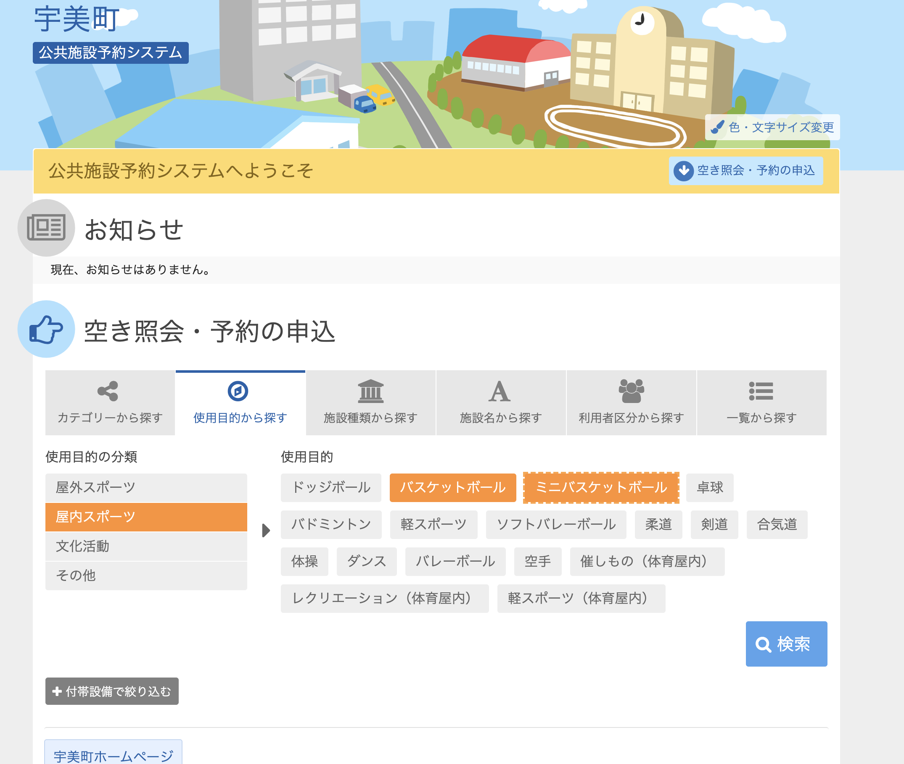
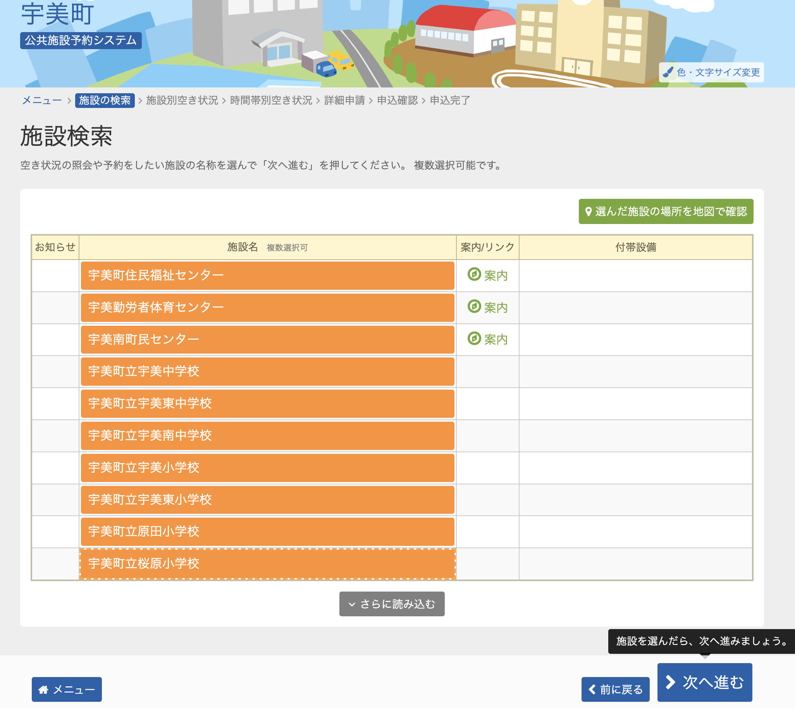
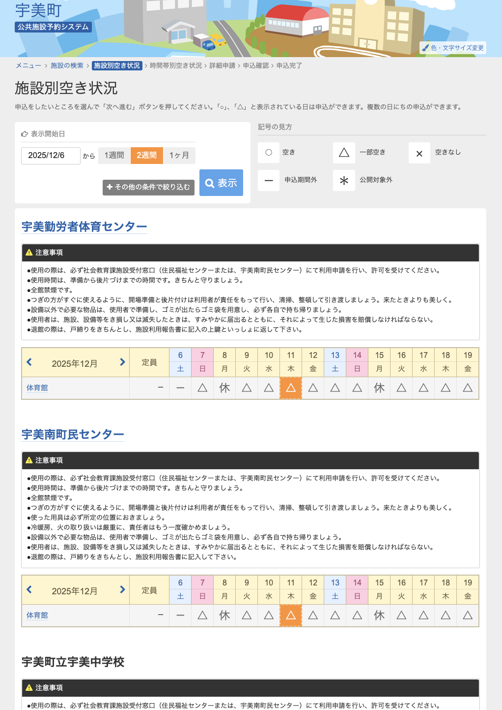
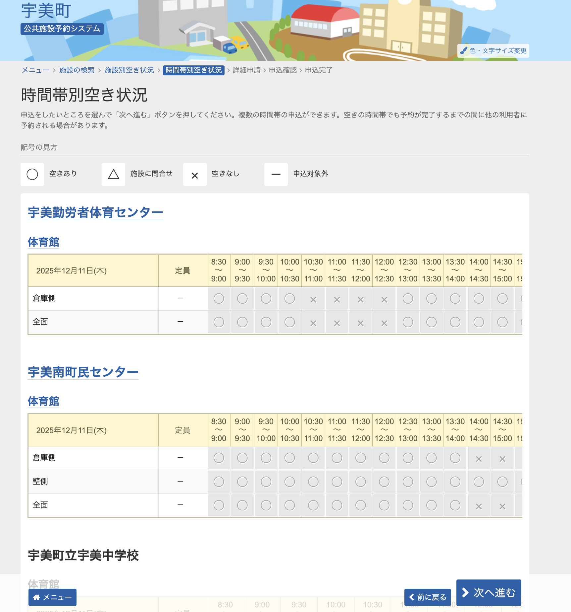

# 実際の画面を手動で操作した際の手順と説明を記載する
本書をもとにスクレイピング先のサイトの調査を進めてほしい

# 手順

## 前提
本書記載日は12/6である。
検索調べたい日は12/11とする。

## 1. サイトにアクセス
https://www.11489.jp/Umi/web/Home/WgR_ModeSelect
空き照会・予約の申込　画面が表示される

## 2. 施設の絞り込み

1. 空き照会・予約の申込　画面の「使用目的から探す」タブをクリック  →セレクタ： `.purpose > a`
2. 「使用目的の分類」の一覧から「屋内スポーツ」をクリック →セレクタ： `.purpose.tabs-panel .toggle input[type="radio"][id="radioPurposeLarge02"]` 
3. 「使用目的」の一覧から「バスケットボール」と「ミニバスケットボール」を選択 →セレクタ： `#checkPurposeMiddle505` （バスケットボール）、 `#checkPurposeMiddle510` （ミニバスケットボール）
4. 「検索」ボタンを押下（施設検索ページに遷移）　→セレクタ： `#btnSearchViaPurpose`

## 3. 施設検索ぺーじで施設を選択

施設検索ページのURLは、以下。
https://www.11489.jp/Umi/web/Yoyaku/WgR_ShisetsuKensaku

1. 施設一覧が表示されている
2. 「さらに読み込む」ボタンがある場合は一覧で見えていないものがあるためクリック
3. 一覧にあるすべての施設をすべてクリック　→セレクタ：　`.shisetsu input[type="checkbox"][name="checkShisetsu"]`
4. 「次へ進む」ボタンをクリック（施設別空き状況ページに遷移） →セレクタ：　`.navbar .next > a`

## 4. 施設別空き状況ページで対象日を選択

施設別空き状況ページのURLは、以下。
https://www.11489.jp/Umi/web/Yoyaku/WgR_ShisetsubetsuAkiJoukyou

1. 施設検索ページで選択した施設ごとに横スクロールで日付が並んでいる →セレクタ: `.item .calendar`
2. 各施設ごとに対象日のマスをクリックしていく →セレクタ： `.calendar .even input[type="checkbox"][name="checkdate"]`
3. 「次へ進む」ボタンをクリック（時間帯別空き状況ページに遷移） →セレクタ：　`.navbar .next > a`

※選択できる日は最大１０までの様子。エラーが出る
※選択できる日は「○」「△」「－」のみ。
※「×」は選択できるが、全時間借りられているため選択せずとも「空きなし」としてOK。
※「休」は選択できない

## 5. 時間帯別空き状況ページで空き状況を確認

時間帯別空き状況ページのURLは、以下。
https://www.11489.jp/Umi/web/Yoyaku/WgR_JikantaibetsuAkiJoukyou

この画面で空き状況がわかるため、ここまでの遷移でスクレイピングは終了してよい。

1. 各施設ごとに横スクロールで時間帯（8:30〜３０分区切り）で並んでいる　→セレクタ： `.item .calendar`
   1. ※施設ごとに「倉庫側」「ステージ側」「全面」「入口側」など、体育館のどのコートが空いているか行が別れている `.calendar tr` がそれぞれのコートの行
2. 施設内のコートごと（ `.calendar tr .shisetsu` ）に、「○」「×」「保守作業」「公的行事」があり、「○」の部分が借りられる時間帯となる →セレクタ： `.calendar tr td label`
3. 「前に戻る」ボタンをクリックすることで、施設別空き状況ページに戻って日付を再選択することが可能 →セレクタ：　`.navbar .prev > a`

### 主導調査してみての要件変更箇所

- 選択できる日付は、直近２週間という制約を入れた方が良さそう
- 複数日はなんとか実現したいため、時間帯別空き状況ページから前に戻り、施設別空き状況ページに戻って別日を指定することを繰り返すことでなんとか対応できないか？